>欢迎访问：
>
>- :point_right:[https://blog.csdn.net/qq_44766883](https://blog.csdn.net/qq_44766883?)
>- :point_right: [https://blog.codekiller.top/](https://blog.codekiller.top/)
>
>可以的话，点个Star🌟吧。:thumbsup:

## 简介

### **离线计算**

离线计算一般指通过**批处理**的方式计算**已知的所有输入数据**，**输入数据不会产生变化**，一般**计算量级较大，计算时间较长**。

例如今天凌晨一点，把昨天累积的日志，计算出所需结果。最经典的就是 **Hadoop 的 MapReduce** 方式；

一般需要根据前一日的数据生成报表，虽然统计指标、报表繁多，但是对时效性不敏感。

**离线计算的特点：**

1. 数据在计算前已经全部就位，不会发生变化；
2. 数据量大且保存时间长；
3. 在大量数据上进行复杂的批量运算；
4. 方便的查看批量计算的结果。


### 实时计算

实时计算一般是指通过**流处理**方式计算**当日的数据**都算是实时计算。

也会有一些准实时计算，利用离线框架通过批处理完成（小时、10 分钟级）的计算，一般为过渡产品，不能算是实时计算。

**实时计算的特点：**

1. **局部计算**。每次计算以输入的每条数据，或者微批次、小窗口的数据范围进行计算，没法像离线数据一样能够基于当日全部数据进行统计排序分组；
2. **开发成本较高**。相比离线的批处理 SQL，实时计算需要通过**代码**，往往需要对接多种数据容器完成，相对开发较为复杂；
3. **资源成本较高**。实时计算虽然单位时间内数据量不如批处理，但是需要 24 小时不停进行运行，一旦计算资源投入就无法释放，所以每个任务都要合理分配资源。
4. **时效性**。实时计算往往对时效性有一定的要求，所以要尽量优化整个计算链，减少计算过程中的中间环节。

5. **可视化性**。因为数据是不断变化的，所以相对于严谨整齐的离线报表，实时数据更寄希望通过图形化的手段能够及时的观察到数据趋势。 


### 离线数仓架构设计

<center>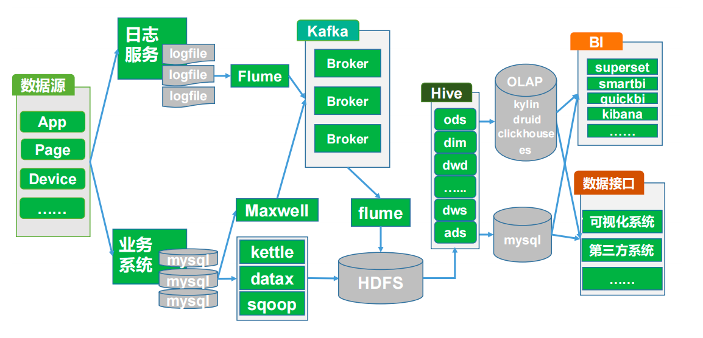</center>


### 实时数仓架构设计

<center>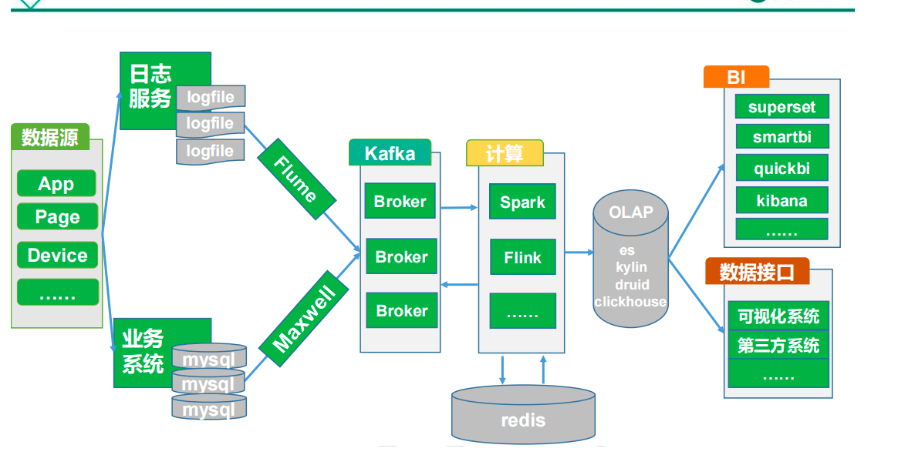</center>

在这个架构中，kafka既要提供源数据，也要存储计算产生的中间数据(也就是DW层的数据)。

并且计算时要判断mysql中的数据时事实数据还是维度数据，如果是维度数据需要保存到redis中(也就是DIM层的数据)，供之后使用。

在实时数仓中，计算其实并没有进行一个明确的分层，需要自行设计，比如：

- 数据采集到Kafka中，是最原始的数据，作为ODS层；
- Kafka中的数据进行一次分流，数据写回kafka，最为DWD层；
- 维度数据存储到redis中，作为DIM层；
- 计算好的数据写到OLAP中，作为DWS层。
- ADS聚合的话就是直接使用OLAP进行分析出结果了。


### 数据来源

数据一共有两大来源：

1. **业务库**：比如mysql，可以通过MaxWell抽取进入kafka，也可以通过datax、sqoop等直接抽取进HDFS；
2. **埋点日志**：线上系统会打入各种日志，这些日志一般以文件的形式保存，我们可以选择用 Flume 定时抽取，也可以用用 Spark Streaming 或者 Storm 来实时接入，当然，Kafka 也会是一个关键的角色。


### 数据分层

#### 介绍

数据分层是使用一种**有效的数据组织和管理方法来让我们的数据体系更有序**。数据分层并不能解决所有的数据问题，但是，数据分层却可以给我们带来如下的好处：

- **清晰数据结构**：每一个数据分层都有它的作用域和职责，在使用表的时候能更方便地定位和理解
- **减少重复开发**：规范数据分层，开发一些通用的中间层数据，能够减少极大的重复计算
- **统一数据口径**：通过数据分层，提供统一的数据出口，统一对外输出的数据口径
- **复杂问题简单化**：将一个复杂的任务分解成多个步骤来完成，每一层解决特定的问题

**我们将数据模型分为三层：数据运营层（ ODS ）、数据仓库层（DW）和数据应用层（APP）：**

- ODS层存放的是接入的**原始数据经**；
- DW层是存放我们要重点设计的数据仓库**中间层数据**；
- APP是**面向业务定制的应用数据**。

<center>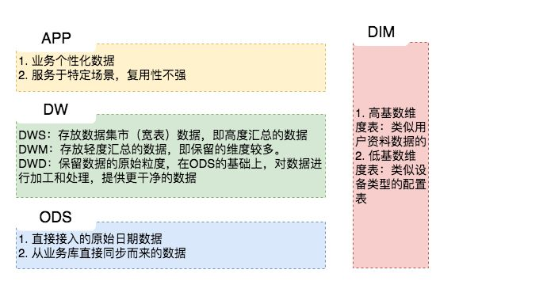</center>


#### 数据运营层：ODS（Operational Data Store）

“面向主题的”数据运营层，也叫ODS层，是最接近数据源中数据的一层，数据源中的数据，经过抽取、洗净、传输，也就说传说中的 **ETL** 之后，装入本层。本层的数据，总体上**大多是按照源头业务系统的分类方式而分类的**。

**一般来讲，为了考虑后续可能需要追溯数据问题，因此对于这一层就不建议做过多的数据清洗工作，原封不动地接入原始数据即可，至于数据的去噪、去重、异常值处理等过程可以放在后面的DWD层来做。**

>**问：**还是不太明白 ods 和 dwd 层的区别，有了 ods 层后感觉 dwd 没有什么用了。
>
>**答：**嗯，我是这样理解的，站在一个理想的角度来讲，如果 ods 层的数据就非常规整，基本能满足我们绝大部分的需求，这当然是好的，这时候 dwd 层其实也没太大必要。 但是现实中接触的情况是 ods 层的数据很难保证质量，毕竟数据的来源多种多样，推送方也会有自己的推送逻辑，在这种情况下，我们就需要通过额外的一层 dwd 来屏蔽一些底层的差异。
>
>**问：**我大概明白了，是不是说 dwd 主要是对 ods 层做一些数据清洗和规范化的操作，dws 主要是对 ods 层数据做一些轻度的汇总?
>
>**答：**对的，可以大致这样理解。


#### 数据仓库层：DW（Data Warehouse）

数据仓库层是我们在做数据仓库时要核心设计的一层，在这里，**从 ODS 层中获得的数据按照主题进行分流建立各种数据模型**。DW层又细分为 **DWD（Data Warehouse Detail）**层、**DWM（Data WareHouse Middle）**层和**DWS（Data WareHouse Servce）层。**

##### 数据明细层：DWD（Data Warehouse Detail）

该层一般保持和ODS层一样的数据粒度，并且提供一定的数据质量保证。同时，为了提高数据明细层的易用性，该层会采用一些维度退化手法，将维度退化至事实表中，减少事实表和维表的关联。

另外，在该层也会做一部分的数据聚合，将相同主题的数据汇集到一张表中，提高数据的可用性。


##### 数据中间层：DWM（Data WareHouse Middle）
该层会在DWD层的数据基础上，**对数据做轻度的聚合操作，生成一系列的中间表**，提升公共指标的复用性，减少重复加工。

直观来讲，就是对通用的核心维度进行聚合操作，算出相应的统计指标。

- 数据生成方式：由明细层按照一定的业务需求生成轻度汇总表。明细层需要复杂清洗的数据和需要MR处理的数据也经过处理后接入到轻度汇总层。
- 日志存储方式：内表，parquet文件格式。
- 日志删除方式：长久存储。
- 表schema：一般按天创建分区，没有时间概念的按具体业务选择分区字段。
- 库与表命名。库名：dwb,表名：初步考虑格式为：dwb日期业务表名,待定。
- 旧数据更新方式：直接覆盖


##### 数据服务层：DWS（Data WareHouse Servce）

又称数据集市或宽表。**按照业务划分**，如流量、订单、用户等，生成字段比较多的**宽表**，用于提供后续的业务查询，OLAP分析，数据分发等。

一般来讲，该层的数据表会相对比较少，一张表会涵盖比较多的业务内容，由于其字段较多，因此一般也会称该层的表为宽表。

**在实际计算中，如果直接从DWD或者ODS计算出宽表的统计指标，会存在计算量太大并且维度太少的问题，因此一般的做法是，在DWM层先计算出多个小的中间表，然后再拼接成一张DWS的宽表。由于宽和窄的界限不易界定，也可以去掉DWM这一层，只留DWS层，将所有的数据在放在DWS亦可。**

- 数据生成方式：由轻度汇总层和明细层数据计算生成。
- 日志存储方式：使用impala内表，parquet文件格式。
- 日志删除方式：长久存储。
- 表schema：一般按天创建分区，没有时间概念的按具体业务选择分区字段。
- 库与表命名。库名：dm,表名：初步考虑格式为：dm日期业务表名,待定。
- 旧数据更新方式：直接覆盖

>**问答一： dws 和 dwd 的关系**
>
>**问：**dws 和dwd 是并行而不是先后顺序?
>
>**答：**并行的，dw 层
>
>**问：**那其实对于同一个数据，这两个过程是串行的?
>
>**答：**dws 会做汇总，dwd 和 ods 的粒度相同，这两层之间也没有依赖的关系
>
>**问：**对呀，那这样 dws 里面的汇总没有经过数据质量和完整度的处理，或者单独做了这种质量相关的处理，为什么不在 dwd 之上再做汇总呢?我的疑问其实就是，dws的轻度汇总数据结果，有没有做数据质量的处理?
>
>**答：**ods 直接到 dws 就好，没必要过 dwd，我举个例子，你的浏览商品行为，我做一层轻度汇总，就直接放在 dws 了。但是你的资料表，要从好多表凑成一份，我们从四五份个人资料表中凑出来了一份完整的资料表放在了 dwd 中。然后在 app 层，我们要出一张画像表，包含用户资料和用户近一年的行为，我们就直接从dwd中拿资料， 然后再在 dws 的基础上做一层统计，就成一个app表了。当然，这不是绝对，dws 和 dwd 有没有依赖关系主要看有没有这种需求。


##### 维表层：DIM（Dimension）

维表层主要包含两部分数据：

- **高基数维度数据：一般是用户资料表、商品资料表类似的资料表**。数据量可能是千万级或者上亿级别；
- **低基数维度数据：一般是配置表，比如枚举值对应的中文含义，或者日期维表。**数据量可能是个位数或者几千几万。


#### 数据应用层：APP（Application）

应用层是根据业务需要，由前面几层数据统计而出的结果，可以直接提供查询展现，或导入至Mysql中使用，也就是**主要提供给数据产品和数据分析使用的数据**。一般会存放在 ES、PostgreSql、Redis等系统中供线上系统使用，也可能会存在 Hive 或者 Druid 中供数据分析和数据挖掘使用。比如我们经常说的报表数据，一般就放在这里。

**这里面也主要分两种类型：**

1. 每日定时任务型：比如我们典型的日计算任务，每天凌晨算前一天的数据，早上起来看报表。 这种任务经常使用 Hive、Spark 或者生撸 MR 程序来计算，最终结果写入 Hive、Hbase、Mysql、Es 或者 Redis 中。
2. 实时数据：这部分主要是各种实时的系统使用，比如我们的实时推荐、实时用户画像，一般我们会用 Spark Streaming、Storm 或者 Flink 来计算，最后会落入 Es、Hbase 或者 Redis 中。

- 数据生成方式：由明细层、轻度汇总层，数据集市层生成，一般要求数据主要来源于集市层。
- 日志存储方式：使用impala内表，parquet文件格式。
- 日志删除方式：长久存储。
- 表schema：一般按天创建分区，没有时间概念的按具体业务选择分区字段。
- 库与表命名。库名：暂定apl，另外根据业务不同，不限定一定要一个库。(其实就叫app_)就好了
- 旧数据更新方式：直接覆盖。

>**问：**存到 Redis、ES 中的数据算是 app层吗?
>
>**答：**算是的，我个人的理解，app 层主要存放一些相对成熟的表，能供业务侧使用的。这些表可以在 Hive 中，也可以是从 Hive 导入 Redis 或者 ES 这种查询性能比较好的系统中。


#### 举例说明

举个栗子说明一下，如下图，可以认为是一个电商网站的数据体系设计。我们暂且只关注用户访问日志这一部分数据。

- 在ODS层中，由于各端的开发团队不同或者各种其它问题，用户的访问日志被分成了好几张表上报到了我们的ODS层。
- 为了方便大家的使用，我们在DWD层做了一张用户访问行为天表，在这里，我们将PC网页、H5、小程序和原生APP访问日志汇聚到一张表里面，统一字段名，提升数据质量，这样就有了一张可供大家方便使用的明细表了。
- 在DWM层，我们会从DWD层中选取业务关注的核心维度来做聚合操作，比如只保留人、商品、设备和页面区域维度。类似的，我们这样做了很多个DWM的中间表
- 然后在DWS层，我们将一个人在整个网站中的行为数据放到一张表中，这就是我们的宽表了，有了这张表，就可以快速满足大部分的通用型业务需求了。
- 最后，在APP应用层，根据需求从DWS层的一张或者多张表取出数据拼接成一张应用表即可。

<center>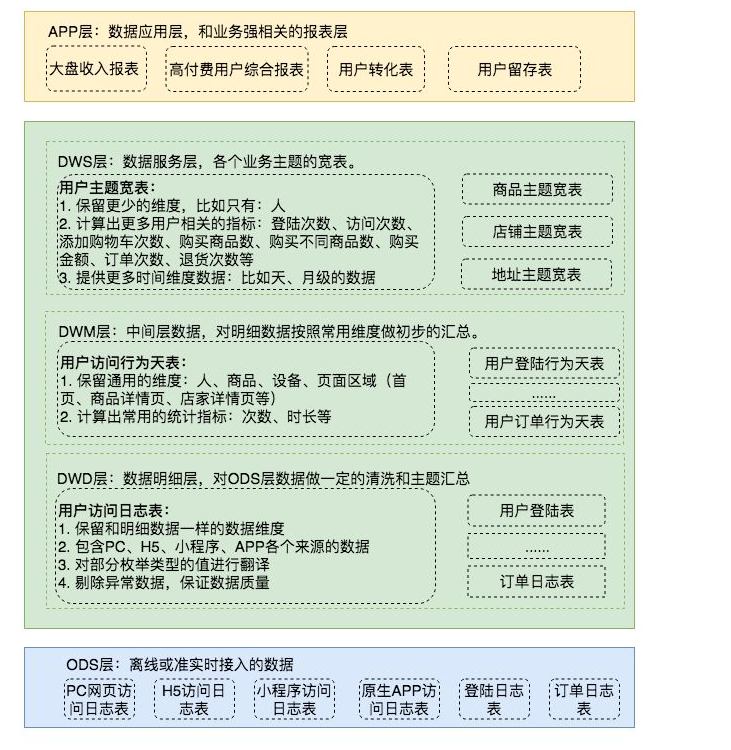</center>


#### Hive数仓的分层

在原有天级延迟的离线数据处理任务基础上，开发小时级延迟的数据处理链路，将核心数据按小时同步到Hive数仓中，每小时调度一次DAG任务，实现小时级任务计算。任务DAG示意图如下所示：

<center>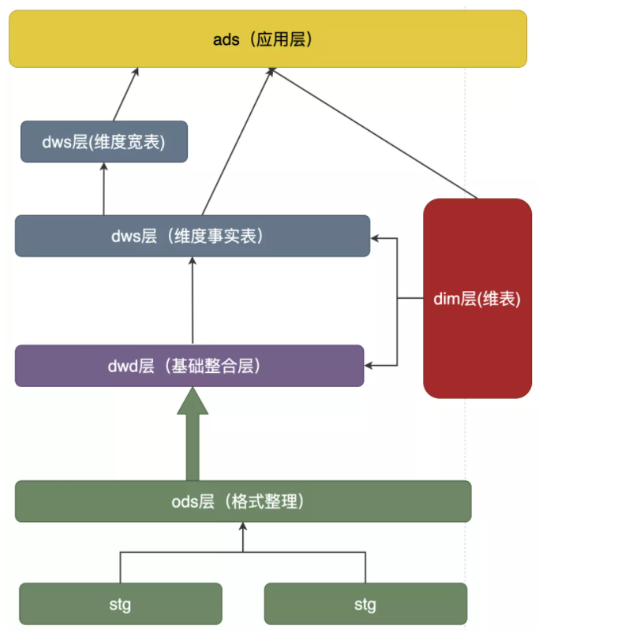</center>

优点：

- 离线和小时级任务各自独立
- 代码逻辑复用性高，减少开发成本
- 可以使用离线数据覆盖小时级数据，进行数据修复

缺点：

- 小时级数据的延迟性还是很高，已无法满足业务对数据时效性的要求
- MapReduce不适合分钟级频次的任务调度，主要是MapReduce任务启动慢，另外会过高的频次会产生很多小文件，影响HDFS的稳定性，以及SQL on Hadoop系统的查询速度
- 批量数据处理每次运行对资源要求高，尤其是当凌晨Hadoop资源紧张时，任务经常无法得到调度，延迟严重


> 参考：:point_right:  [数据仓库之数仓分层及hive分层 ](https://www.cnblogs.com/nthforsth/p/15088600.html)


### 事实表和维度表

#### 事实表

事实表（Fact Table）是指存储有事实记录的表，如系统日志、销售记录等；事实表的记录在不断地动态增长，所以它的体积通常远大于其他表。

事实表作为数据仓库建模的核心，需要根据业务过程来设计，包含了引用的维度和业务过程有关的度量。

作为度量业务过程的事实，一般为整型或浮点型的十进制数值，有可加性，半可加性和不可加性三种类型：

- 可加：最灵活最有用的事实是完全可加，可加性度量可以按照与事实表关联的任意维度汇总。比如消费总金额；
- 半可加：半可加度量可以对某些维度汇总，但不能对所有维度汇总。差额是常见的半可加事实，除了时间维度外，他们可以跨所有维度进行操作。(比如每天的余额加起来毫无意义)；
- 不可加：一些度量是完全不可加的，例如：比率。对非可加事实，一种好的方法是，分解为可加的组件来实现聚集。

#### 维度表

维度表（Dimension Table）或维表，有时也称查找表（Lookup Table），是与事实表相对应的一种表；它保存了维度的属性值，可以跟事实表做关联；相当于**将事实表上经常重复出现的属性抽取、规范出来用一张表进行管理**。常见的维度表有：日期表（存储与日期对应的周、月、季度等的属性）、地点表（包含国家、省／州、城市等属性）等。维度是维度建模的基础和灵魂，

使用维度表有诸多好处，具体如下：

- 缩小了事实表的大小。
- 便于维度的管理和维护，增加、删除和修改维度的属性，不必对事实表的大量记录进行改动。
- 维度表可以为多个事实表重用，以减少重复工作。

#### 事实表和维度表关系

<center>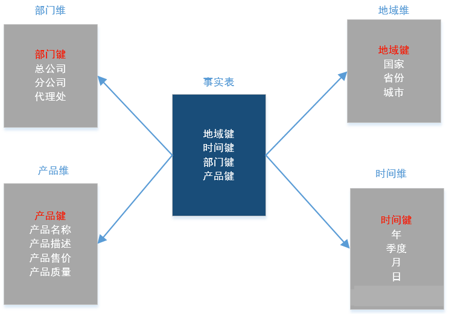</center>

> 事实表和维度表的选择是根据目标对象的需要来选择的，以user表为例，当目标分析为宏观的量级分析时，加工后uesr表通常作为维度表（雪花型）；当目标分析为微观的某用户细节变化分析时，加工后的user表也可作为事实表。


## 软件安装

### zk & kafka

```bash
docker pull wurstmeister/zookeeper
docker pull wurstmeister/kafka

docker run --privileged=true  -d -e TZ="Asia/Shanghai" -p 2181:2181 -v /root/zk/data:/data --name zookeeper --restart always zookeeper 

# 安装kafka
docker run \
-p 9092:9092 \
--name kafka \
--privileged=true \
-e KAFKA_BROKER_ID=0 \
-e KAFKA_ZOOKEEPER_CONNECT=192.168.6.134:2181 \
-e KAFKA_ADVERTISED_LISTENERS=PLAINTEXT://192.168.6.134:9092 \
-e KAFKA_LISTENERS=PLAINTEXT://0.0.0.0:9092 \
-d wurstmeister/kafka
# 创建挂载目录
mkdir -p ~/kafka
# 將kafka的配置文件复制到挂载目录
docker cp -a kafka:/opt/kafka/config/ /mydata/kafka/config
docker cp -a kafka:/opt/kafka/logs/ /mydata/kafka/logs
# 删除容器
docker rm -f kafka
# 安装容器
docker run \
-p 9092:9092 \
--name kafka \
--privileged=true \
-e KAFKA_BROKER_ID=0 \
-e KAFKA_ZOOKEEPER_CONNECT=192.168.6.134:2181 \
-e KAFKA_ADVERTISED_LISTENERS=PLAINTEXT://192.168.6.134:9092 \
-e KAFKA_LISTENERS=PLAINTEXT://0.0.0.0:9092 \
-v ~/kafka/config:/opt/kafka/config \
-v ~/kafka/logs:/opt/kafka/logs \
-d wurstmeister/kafka
```

测试：

```bash
# kafka生产一条消息
docker exec -it kafka /bin/bash
cd /opt/kafka_2.11-2.0.0/bin
./kafka-console-producer.sh --broker-list localhost:9092 --topic sun

# zk查看
docker exec -it zookeeper /bin/bash
cd bin
./zkCli.sh
ls /brokers/topics/sun/partitions
# 会有一个[0]
```


### redis

```bash
docker pull redis
# 创建挂载目录
mkdir  ~/redis
cd ~/redis
mkdir data
mkdir conf
cd conf 
vim redis.conf
# 添加如下
#bind 127.0.0.1 
protected-mode no
appendonly yes 
requirepass root 

# 创建容器
docker run --privileged=true -p 6379:6379 --name redis -v /root/redis/data:/data -v /root/redis/conf/redis.conf:/usr/local/etc/redis/redis.conf -d redis redis-server /usr/local/etc/redis/redis.conf --appendonly yes --requirepass "root"
```


### Maxwell

1. 将安装包上传到节点/opt/softwar目录

2. 解压到/opt/module/目录下

   ```bash
   tar -zxvf maxwell-1.29.2.tar.gz -C /opt/module/
   ```

3. 修改名称

   ```bash
   mv maxwell-1.29.2/ maxwell
   ```


### Mysql

```bash
docker pull mysql
# max下安装
docker pull biarms/mysql:5.7.30-linux-arm64v8

mkdir ~/conf
mkdir ~/data
mkdir ~/logs
vim ~/mysql/conf/my.cnf
# 写入
[mysqld]
pid-file        = /var/run/mysqld/mysqld.pid
socket          = /var/run/mysqld/mysqld.sock
datadir         = /var/lib/mysql
secure-file-priv= NULL
# Disabling symbolic-links is recommended to prevent assorted security risks
symbolic-links=0
character-set-server=utf8 
[client]
default-character-set=utf8 
[mysql]
default-character-set=utf8 
# Custom config should go here
!includedir /etc/mysql/conf.d/


docker run --privileged=true --restart=always -d -v ~/mysql/conf/my.cnf:/etc/mysql/my.cnf -v ~/mysql/logs:/logs -v ~/mysql/data/mysql:/var/lib/mysql  -p 3306:3306 --name mysql -e MYSQL_ROOT_PASSWORD=root biarms/mysql:5.7.30-linux-arm64v8
```


### es

```bash
docker run -d --name es -p 9200:9200 -p 9300:9300 -e "discovery.type=single-node" elasticsearch:8.3.2
docker cp elasticsearch:/usr/share/elasticsearch/config /opt/module

vim elasticsearch.yml
# 修改为
xpack.security.enabled: false

vim jvm.options
-Xms512m
-Xmx512m

# 运行
docker run --privileged=true --name es -p 9200:9200  -p 9300:9300 \
-e "discovery.type=single-node"  \
-v /opt/module/es/config:/usr/share/elasticsearch/config \
-v /opt/module/es/data:/usr/share/elasticsearch/data \
-v /opt/module/es/plugins:/usr/share/elasticsearch/plugins \
-d elasticsearch:8.3.2
```


### kibana

```bash
docker pull kibana:8.3.2

mkdir  ~/kibana
cd kibana
vim kibana.yml
server.host: "0.0.0.0"
elasticsearch.hosts: ["http://127.0.0.1:9200"]

docker run --privileged=true --name kibana \
 -v ~/kibana/config:/usr/share/kibana/config -p 5601:5601 \
 -d kibana:8.3.2
```

> 这里我发现一个好坑的地方，一定要先启动es，再启动kibana，不然会有问题。


## 日志数据采集和分流

### 整体架构

<center>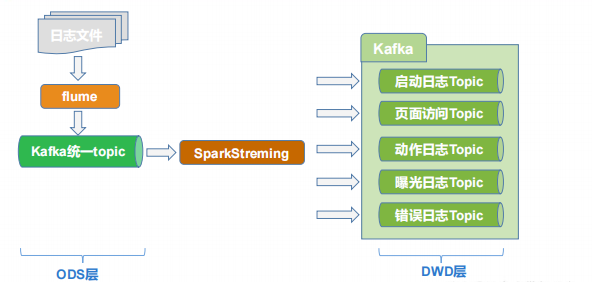</center>


### 模拟采集日志数据

有如下工具：

```bash
application.yml  gmall2020-mock-log-2021-11-29.jar  logback.xml  path.json
```

（1）启动一个kafka消费者来测试：

```bash
./kafka-console-consumer.sh --bootstrap-server 127.0.0.1:9092 --topic ODS_BASE_LOG_1018
```

（2）**根据实际需要修改** **application.yml** 的如下配置

<center>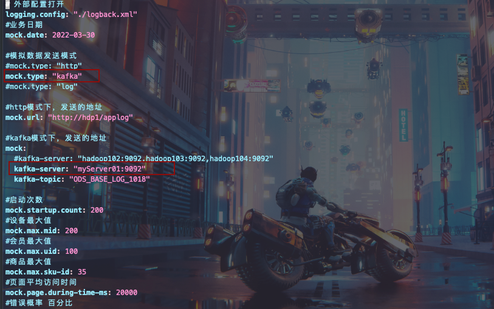</center>

（3）生成测试数据

```bash
java -jar gmall2020-mock-log-2021-11-29.jar
```

（4）kafka消费者查看数据：


### 辅助脚本

（1）模拟生成数据log.sh

```shell
#!/bin/bash
#根据传递的日期参数修改配置文件的日期
if [ $# -ge 1 ]
then
sed -i "/mock.date/c mock.date: $1" /root/spark实时数仓/数据生成器/日志数据生成器/application.yml
fi
cd /root/spark实时数仓/数据生成器/日志数据生成器;
java -jar gmall2020-mock-log-2021-11-29.jar >/dev/null 2>&1 &
```


（2）Kafka脚本

```shell
#!/bin/bash
if [ $# -lt 1 ]
then 
	echo "Usage: kf.sh {start|stop|kc [topic]|kp [topic] |list |delete [topic] |describe [topic]}"
	exit
fi
case $1 in 
start)
	for i in myServer01 hadoop103 hadoop104
	do
		echo "====================> START $i KF <===================="
		ssh $i kafka-server-start.sh -daemon /opt/module/kafka_2.11-2.4.1/config/server.properties 
	done
;;

stop)
	for i in myServer01 hadoop103 hadoop104
	do
		echo "====================> STOP $i KF <===================="
		ssh $i kafka-server-stop.sh
	done
;;
kc)
	if [ $2 ]
	then
		kafka-console-consumer.sh --bootstrap-server myServer01:9092,hadoop103:9092,hadoop104:9092 --topic $2
	else
		echo "Usage: kf.sh {start|stop|kc [topic]|kp [topic] |list |delete [topic] |describe [topic]}"
	fi
;;
kp)
	if [ $2 ]
	then 
		kafka-console-producer.sh --broker-list myServer01:9092,hadoop103:9092,hadoop104:9092 --topic $2
	else
		echo "Usage: kf.sh {start|stop|kc [topic]|kp [topic] |list |delete [topic] |describe [topic]}"
	fi
;;

list)
	kafka-topics.sh --list --bootstrap-server myServer01:9092,hadoop103:9092,hadoop104:9092
;;
describe)
	if [ $2 ]
	then
		kafka-topics.sh --describe --bootstrap-server myServer01:9092,hadoop103:9092,hadoop104:9092 --topic $2
	else
		echo "Usage: kf.sh {start|stop|kc [topic]|kp [topic] |list |delete [topic] |describe [topic]}"
	fi 
;;
delete)
	if [ $2 ]
	then
		kafka-topics.sh --delete --bootstrap-server myServer01:9092,hadoop103:9092,hadoop104:9092 --topic $2
	else
		echo "Usage: kf.sh {start|stop|kc [topic]|kp [topic] |list |delete [topic] |describe [topic]}"
	fi
;;
*)
	echo "Usage: kf.sh {start|stop|kc [topic]|kp [topic] |list |delete [topic] |describe [topic]}"
	exit
;;
esac
```


### 创建工程

#### 依赖

```xml
<?xml version="1.0" encoding="UTF-8"?>
<project xmlns="http://maven.apache.org/POM/4.0.0"
     xmlns:xsi="http://www.w3.org/2001/XMLSchema-instance"
     xsi:schemaLocation="http://maven.apache.org/POM/4.0.0 http://maven.apache.org/xsd/maven-4.0.0.xsd">
<parent>
    <artifactId>spark-gmall-realtime</artifactId>
    <groupId>top.codekiller.gmall</groupId>
    <version>1.0-SNAPSHOT</version>
</parent>
<modelVersion>4.0.0</modelVersion>

<artifactId>sparkstream-realtime</artifactId>

    <properties>
        <spark.version>3.0.0</spark.version>
        <scala.version>2.12.11</scala.version>
        <kafka.version>2.4.1</kafka.version>
        <project.build.sourceEncoding>UTF-8</project.build.sourceEncoding>
        <project.reporting.outputEncoding>UTF-8</project.reporting.outputEncoding>
        <java.version>1.8</java.version>
    </properties>

    <dependencies>
        <dependency>
            <groupId>com.alibaba</groupId>
            <artifactId>fastjson</artifactId>
            <version>1.2.62</version>
        </dependency>

        <dependency>
            <groupId>org.apache.spark</groupId>
            <artifactId>spark-core_2.12</artifactId>
            <version>${spark.version}</version>
        </dependency>
        <dependency>
            <groupId>org.apache.spark</groupId>
            <artifactId>spark-streaming_2.12</artifactId>
            <version>${spark.version}</version>
        </dependency>
        <dependency>
            <groupId>org.apache.kafka</groupId>
            <artifactId>kafka-clients</artifactId>
            <version>${kafka.version}</version>

        </dependency>
        <dependency>
            <groupId>org.apache.spark</groupId>
            <artifactId>spark-streaming-kafka-0-10_2.12</artifactId>
            <version>${spark.version}</version>
        </dependency>

        <dependency>
            <groupId>org.apache.spark</groupId>
            <artifactId>spark-sql_2.12</artifactId>
            <version>${spark.version}</version>
        </dependency>

        <dependency>
            <groupId>com.fasterxml.jackson.core</groupId>
            <artifactId>jackson-core</artifactId>
            <version>2.11.0</version>
        </dependency>

        <dependency>
            <groupId>org.apache.logging.log4j</groupId>
            <artifactId>log4j-to-slf4j</artifactId>
            <version>2.11.0</version>
        </dependency>

        <dependency>
            <groupId>mysql</groupId>
            <artifactId>mysql-connector-java</artifactId>
            <version>5.1.47</version>
        </dependency>

        <dependency>
            <groupId>redis.clients</groupId>
            <artifactId>jedis</artifactId>
            <version>3.3.0</version>
        </dependency>

        <dependency>
            <groupId>org.elasticsearch</groupId>
            <artifactId>elasticsearch</artifactId>
            <version>7.8.0</version>
        </dependency>

        <dependency>
            <groupId>org.elasticsearch.client</groupId>
            <artifactId>elasticsearch-rest-high-level-client</artifactId>
            <version>7.8.0</version>
        </dependency>

        <dependency>
            <groupId>org.apache.httpcomponents</groupId>
            <artifactId>httpclient</artifactId>
            <version>4.5.10</version>
        </dependency>

    </dependencies>

    <build>
        <plugins>
            <!-- 该插件用于将Scala代码编译成class文件 -->
            <plugin>
                <groupId>net.alchim31.maven</groupId>
                <artifactId>scala-maven-plugin</artifactId>
                <version>3.4.6</version>
                <executions>
                    <execution>
                        <!-- 声明绑定到maven的compile阶段 -->
                        <goals>
                            <goal>compile</goal>
                            <goal>testCompile</goal>
                        </goals>
                    </execution>
                </executions>
            </plugin>

            <plugin>
                <groupId>org.apache.maven.plugins</groupId>
                <artifactId>maven-assembly-plugin</artifactId>
                <version>3.0.0</version>
                <configuration>
                    <descriptorRefs>
                        <descriptorRef>jar-with-dependencies</descriptorRef>
                    </descriptorRefs>
                </configuration>
                <executions>
                    <execution>
                        <id>make-assembly</id>
                        <phase>package</phase>
                        <goals>
                            <goal>single</goal>
                        </goals>
                    </execution>
                </executions>
            </plugin>
        </plugins>
    </build>

</project>
```


#### 配置文件

config.properties：

```properties
#kafka
kafka.bootstrap-servers=192.168.6.134:9092
```

Log4j.properties：

```properties
log4j.appender.atguigu.MyConsole=org.apache.log4j.ConsoleAppender
log4j.appender.atguigu.MyConsole.target=System.out
log4j.appender.atguigu.MyConsole.layout=org.apache.log4j.PatternLayout    
log4j.appender.atguigu.MyConsole.layout.ConversionPattern=%d{yyyy-MM-dd HH:mm:ss} %10p (%c:%M) - %m%n
log4j.rootLogger =error,atguigu.MyConsole
```


#### 添加工具类

##### 配置类

```scala
/**
 * 配置文件解析类
 */
object MyPropsUtils {
  private val bundle: ResourceBundle = ResourceBundle.getBundle("config")

  def apply(propsKey: String):String = {
    bundle.getString(propsKey)
  }

  //def main(args: Array[String]):Unit = {
   // println(MyPropsUtils.apply("kafka.bootstrap-servers"))
  //}

}
```

```scala
/**
 * 配置类
 */
object MyConfig {

  val KAFKA_BOOTSTRAP_SERVERS: String = "kafka.bootstrap-servers"

}
```


##### kafka工具类

```scala
/*
Kafka工具类，用于生产数据和消费数据
 */
object MyKafkaUtils {

  /**
   * 消费者配置
   */
  private val consumerConfigs: mutable.Map[String,Object] = mutable.Map[String,Object](
    //kafka集群配置
    ConsumerConfig.BOOTSTRAP_SERVERS_CONFIG -> MyPropsUtils(MyConfig.KAFKA_BOOTSTRAP_SERVERS),
    // kv反序列化器
    ConsumerConfig.KEY_DESERIALIZER_CLASS_CONFIG -> "org.apache.kafka.common.serialization.StringDeserializer",
    ConsumerConfig.VALUE_DESERIALIZER_CLASS_CONFIG -> "org.apache.kafka.common.serialization.StringDeserializer",
    // groupId
    // offset提交  自动 手动
    ConsumerConfig.ENABLE_AUTO_COMMIT_CONFIG -> "true",
    //自动提交的时间间隔
    //ConsumerConfig.AUTO_COMMIT_INTERVAL_MS_CONFIG
    // offset重置  "latest"  "earliest"
    ConsumerConfig.AUTO_OFFSET_RESET_CONFIG -> "latest"
    // .....
  )

  /**
   * 基于SparkStreaming消费，获取到KafkaDStream
   * @param ssc
   * @param topic
   * @param groupId
   * @return
   */
  def getKafkaDStream(ssc : StreamingContext,topic: String,groupId : String) ={
    consumerConfigs.put(ConsumerConfig.GROUP_ID_CONFIG , groupId)

    val kafkaDStream: InputDStream[ConsumerRecord[String, String]] = KafkaUtils.createDirectStream(ssc,
      LocationStrategies.PreferConsistent,
      ConsumerStrategies.Subscribe[String,String](Array(topic),consumerConfigs))

    kafkaDStream
  }

  var producer : KafkaProducer[String,String] = createProducer()

  /**
   * 创建生产者对象
   */
  def createProducer():KafkaProducer[String,String] = {
    val producerConfigs : util.HashMap[String, AnyRef] = new util.HashMap[String,AnyRef]
    //生产者配置类 ProducerConfig
    //kafka集群位置
    //producerConfigs.put(ProducerConfig.BOOTSTRAP_SERVERS_CONFIG,"hadoop102:9092,hadoop103:9092,hadoop104:9092")
    //producerConfigs.put(ProducerConfig.BOOTSTRAP_SERVERS_CONFIG,MyPropsUtils("kafka.bootstrap-servers"))
    producerConfigs.put(ProducerConfig.BOOTSTRAP_SERVERS_CONFIG,MyPropsUtils(MyConfig.KAFKA_BOOTSTRAP_SERVERS))
    //kv序列化器
    producerConfigs.put(ProducerConfig.KEY_SERIALIZER_CLASS_CONFIG , "org.apache.kafka.common.serialization.StringSerializer")
    producerConfigs.put(ProducerConfig.VALUE_SERIALIZER_CLASS_CONFIG , "org.apache.kafka.common.serialization.StringSerializer")
    //acks
    producerConfigs.put(ProducerConfig.ACKS_CONFIG , "all")
    //batch.size  16kb
    //linger.ms   0
    //retries
    //幂等配置
    producerConfigs.put(ProducerConfig.ENABLE_IDEMPOTENCE_CONFIG , "true")

    val producer: KafkaProducer[String, String] = new KafkaProducer[String,String](producerConfigs)
    producer
  }

  /**
   * 生产（按照key进行分区）
   * @param topic
   * @param key
   * @param msg
   */
  def send(topic:String,key:String,msg :String): Unit ={
    producer.send(new ProducerRecord[String,String](topic,key,msg))
  }

  /**
   * 生产（按照默认的黏性分区策略）
   */
  def send(topic : String  , msg : String ):Unit = {
    producer.send(new ProducerRecord[String,String](topic , msg ))
  }

}
```


### 日志数据消费分流

#### 相关bean

```scala
case class PageActionLog(
                          mid :String,
                          user_id:String,
                          province_id:String,
                          channel:String,
                          is_new:String,
                          model:String,
                          operate_system:String,
                          version_code:String,
                          brand:String ,
                          page_id:String ,
                          last_page_id:String,
                          page_item:String,
                          page_item_type:String,
                          during_time:Long,
                          sourceType:String ,
                          action_id:String,
                          action_item:String,
                          action_item_type:String,
                          action_ts :Long ,
                          ts:Long
                        ) {

}
```

```scala
case class PageDisplayLog(
                           mid :String,
                           user_id:String,
                           province_id:String,
                           channel:String,
                           is_new:String,
                           model:String,
                           operate_system:String,
                           version_code:String,
                           brand : String ,
                           page_id:String ,
                           last_page_id:String,
                           page_item:String,
                           page_item_type:String,
                           during_time:Long,
                           sourceType : String ,
                           display_type:String,
                           display_item: String,
                           display_item_type:String,
                           display_order:String ,
                           display_pos_id:String,
                           ts:Long

                         ) {

}
```

```scala
case class PageLog(
                    mid :String,
                    user_id:String,
                    province_id:String,
                    channel:String,
                    is_new:String,
                    model:String,
                    operate_system:String,
                    version_code:String,
                    brand : String ,
                    page_id:String ,
                    last_page_id:String,
                    page_item:String,
                    page_item_type:String,
                    during_time:Long,
                    sourceType : String ,
                    ts:Long

                  ) {

}
```

```scala
case class StartLog(
                     mid :String,
                     user_id:String,
                     province_id:String,
                     channel:String,
                     is_new:String,
                     model:String,
                     operate_system:String,
                     version_code:String,
                     brand : String ,
                     entry:String,
                     open_ad_id:String,
                     loading_time_ms:Long,
                     open_ad_ms:Long,
                     open_ad_skip_ms:Long,
                     ts:Long

                   ) {

}
```


#### 消费分流

```scala
/**
 * 日志数据的消费分流
 * 1. 准备实时处理环境 StreamingContext
 *
 * 2. 从Kafka中消费数据
 *
 * 3. 处理数据
 *     3.1 转换数据结构
 *           专用结构  Bean
 *           通用结构  Map JsonObject
 *     3.2 分流
 *
 * 4. 写出到DWD层
 */
object OdsBaseLogApp {

  def main(args :Array[String]): Unit ={
    //1. 准备实时环境
    //TODO 注意并行度与Kafka中topic的分区个数的对应关系
    val sparkConf :SparkConf = new SparkConf().setAppName("ods_base_log_app").setMaster("local[3]")
    val ssc: StreamingContext = new StreamingContext(sparkConf,Seconds(5))

    //2. 从kafka中消费数据
    val topicName : String = "ODS_BASE_LOG_1018"  //对应生成器配置中的主题名
    val groupId : String = "ODS_BASE_LOG_GROUP_1018"

    val kafkaDStream : InputDStream[ConsumerRecord[String,String]]= MyKafkaUtils.getKafkaDStream(ssc, topicName, groupId)
//    kafkaDStream.print(100)

    //3. 处理数据
    //3.1 转换数据结构
    val jsonObjDStream : DStream[JSONObject] = kafkaDStream.map(
      consumerRecord =>{
        //获取ConsumerRecord中的value，value就是日志数据
        val log: String = consumerRecord.value()
        //转换成json对象
        val jsonObj: JSONObject = JSON.parseObject(log)
        //返回
        jsonObj
      }
    )
//    jsonObjDStream.print(1000)

    //3.2 分流
    // 日志数据：
    //   页面访问数据
    //      公共字段
    //      页面数据
    //      曝光数据
    //      事件数据
    //      错误数据
    //   启动数据
    //      公共字段
    //      启动数据
    //      错误数据
    val DWD_PAGE_LOG_TOPIC : String = "DWD_PAGE_LOG_TOPIC_1018"  // 页面访问
    val DWD_PAGE_DISPLAY_TOPIC : String = "DWD_PAGE_DISPLAY_TOPIC_1018" //页面曝光
    val DWD_PAGE_ACTION_TOPIC : String = "DWD_PAGE_ACTION_TOPIC_1018" //页面事件
    val DWD_START_LOG_TOPIC : String = "DWD_START_LOG_TOPIC_1018" // 启动数据
    val DWD_ERROR_LOG_TOPIC : String = "DWD_ERROR_LOG_TOPIC_1018" // 错误数据
    //分流规则:
    // 错误数据: 不做任何的拆分， 只要包含错误字段，直接整条数据发送到对应的topic
    // 页面数据: 拆分成页面访问， 曝光， 事件 分别发送到对应的topic
    // 启动数据: 发动到对应的topic

    /*
    RDD（Resilient Distributed Dataset）叫做弹性分布式数据集，是Spark中最基本的数据抽象，它代表一个不可变、可分区、里面的元素可并行计算的集合。
    foreachRDD的作用是对每个批次的RDD做自定义操作
     */
    jsonObjDStream.foreachRDD(
      rdd => {
//        rdd.foreachPartition(
//          jsonObjIter => {
//            for (jsonObj <- jsonObjIter) {
        rdd.foreach( jsonObj =>{
              //分流过程
              //分流错误数据
              val errObj: JSONObject = jsonObj.getJSONObject("err")
              if(errObj != null){
                //将错误数据发送到 DWD_ERROR_LOG_TOPIC
                MyKafkaUtils.send(DWD_ERROR_LOG_TOPIC ,  jsonObj.toJSONString )
              }else{
                // 提取公共字段
                val commonObj: JSONObject = jsonObj.getJSONObject("common")
                val ar: String = commonObj.getString("ar")
                val uid: String = commonObj.getString("uid")
                val os: String = commonObj.getString("os")
                val ch: String = commonObj.getString("ch")
                val isNew: String = commonObj.getString("is_new")
                val md: String = commonObj.getString("md")
                val mid: String = commonObj.getString("mid")
                val vc: String = commonObj.getString("vc")
                val ba: String = commonObj.getString("ba")
                //提取时间戳
                val ts: Long = jsonObj.getLong("ts")
                // 页面数据
                val pageObj: JSONObject = jsonObj.getJSONObject("page")
                if(pageObj != null ){
                  //提取page字段
                  val pageId: String = pageObj.getString("page_id")
                  val pageItem: String = pageObj.getString("item")
                  val pageItemType: String = pageObj.getString("item_type")
                  val duringTime: Long = pageObj.getLong("during_time")
                  val lastPageId: String = pageObj.getString("last_page_id")
                  val sourceType: String = pageObj.getString("source_type")

                  //封装成PageLog
                  var pageLog =
                    PageLog(mid,uid,ar,ch,isNew,md,os,vc,ba,pageId,lastPageId,pageItem,pageItemType,duringTime,sourceType,ts)
                  //发送到DWD_PAGE_LOG_TOPIC
                  MyKafkaUtils.send(DWD_PAGE_LOG_TOPIC , JSON.toJSONString(pageLog , new SerializeConfig(true)))

                  //提取曝光数据
                  val displaysJsonArr: JSONArray = jsonObj.getJSONArray("displays")
                  if(displaysJsonArr != null && displaysJsonArr.size() > 0 ){
                    for(i <- 0 until displaysJsonArr.size()){
                      //循环拿到每个曝光
                      val displayObj: JSONObject = displaysJsonArr.getJSONObject(i)
                      //提取曝光字段
                      val displayType: String = displayObj.getString("display_type")
                      val displayItem: String = displayObj.getString("item")
                      val displayItemType: String = displayObj.getString("item_type")
                      val posId: String = displayObj.getString("pos_id")
                      val order: String = displayObj.getString("order")

                      //封装成PageDisplayLog
                      val pageDisplayLog =
                        PageDisplayLog(mid,uid,ar,ch,isNew,md,os,vc,ba,pageId,lastPageId,pageItem,pageItemType,duringTime,sourceType,displayType,displayItem,displayItemType,order,posId,ts)
                      // 写到 DWD_PAGE_DISPLAY_TOPIC
                      MyKafkaUtils.send(DWD_PAGE_DISPLAY_TOPIC , JSON.toJSONString(pageDisplayLog , new SerializeConfig(true)))
                    }
                  }
                  //提取事件数据（课下完成）
                  val actionJsonArr: JSONArray = jsonObj.getJSONArray("actions")
                  if(actionJsonArr != null && actionJsonArr.size() > 0 ){
                    for(i <- 0 until actionJsonArr.size()){
                      val actionObj: JSONObject = actionJsonArr.getJSONObject(i)
                      //提取字段
                      val actionId: String = actionObj.getString("action_id")
                      val actionItem: String = actionObj.getString("item")
                      val actionItemType: String = actionObj.getString("item_type")
                      val actionTs: Long = actionObj.getLong("ts")

                      //封装PageActionLog
                      var pageActionLog =
                        PageActionLog(mid,uid,ar,ch,isNew,md,os,vc,ba,pageId,lastPageId,pageItem,pageItemType,duringTime,sourceType,actionId,actionItem,actionItemType,actionTs,ts)
                      //写出到DWD_PAGE_ACTION_TOPIC
                      MyKafkaUtils.send(DWD_PAGE_ACTION_TOPIC , JSON.toJSONString(pageActionLog , new SerializeConfig(true)))
                    }
                  }
                }
                // 启动数据（课下完成）
                val startJsonObj: JSONObject = jsonObj.getJSONObject("start")
                if(startJsonObj != null ){
                  //提取字段
                  val entry: String = startJsonObj.getString("entry")
                  val loadingTime: Long = startJsonObj.getLong("loading_time")
                  val openAdId: String = startJsonObj.getString("open_ad_id")
                  val openAdMs: Long = startJsonObj.getLong("open_ad_ms")
                  val openAdSkipMs: Long = startJsonObj.getLong("open_ad_skip_ms")

                  //封装StartLog
                  var startLog =
                    StartLog(mid,uid,ar,ch,isNew,md,os,vc,ba,entry,openAdId,loadingTime,openAdMs,openAdSkipMs,ts)
                  //写出DWD_START_LOG_TOPIC
                  MyKafkaUtils.send(DWD_START_LOG_TOPIC , JSON.toJSONString(startLog ,new SerializeConfig(true)))

                }
              }
//            }
            // foreachPartition里面:  Executor段执行， 每批次每分区执行一次
            //刷写Kafka
//            MyKafkaUtils.flush()
          }
        )

        /*
        rdd.foreach(
          jsonObj => {
            //foreach里面:  提交offset???   A  executor执行, 每条数据执行一次.
            //foreach里面:  刷写kafka缓冲区??? executor执行, 每条数据执行一次.  相当于是同步发送消息.
          }
        )
         */

        //foreachRDD里面，forech外面: 提交offset??? B  Driver段执行，一批次执行一次（周期性）
//        MyOffsetsUtils.saveOffset(topicName,groupId,offsetRanges)
        //foreachRDD里面，forech外面: 刷写Kafka缓冲区??? B  Driver段执行，一批次执行一次（周期性） 分流是在executor端完成，driver端做刷写，刷的不是同一个对象的缓冲区.
      }
    )

    ssc.start()
    ssc.awaitTermination()
  }
}
```


测试：

启动五个消费者：

```bash
kafka-console-consumer.sh --bootstrap-server 127.0.0.1:9092 --topic DWD_PAGE_LOG_TOPIC_1018
kafka-console-consumer.sh --bootstrap-server 127.0.0.1:9092 --topic DWD_PAGE_DISPLAY_TOPIC_1018
kafka-console-consumer.sh --bootstrap-server 127.0.0.1:9092 --topic DWD_PAGE_ACTION_TOPIC_1018
kafka-console-consumer.sh --bootstrap-server 127.0.0.1:9092 --topic DWD_START_LOG_TOPIC_1018
kafka-console-consumer.sh --bootstrap-server 127.0.0.1:9092 --topic DWD_ERROR_LOG_TOPIC_1018
```

然后运行log.sh脚本产生日志数据，最后启动OdsBaseLogApp.main()函数。

就可以看到五个消费者消费的数据了。


### 优化：精确一次消费

#### **相关语义**

1. 至少一次消费（at least once）：主要是保证数据不会丢失，但有可能存在数据重复问题；
2. 最多一次消费 （at most once）：主要是保证数据不会重复，但有可能存在数据丢失问题；
3. 精确一次消费（Exactly-once）：指消息一定会被处理且只会被处理一次。不多不少就一次处理。如果达不到精确一次消费，可能会达到另外两种情况。


#### 消费问题

首先我们知道，kafka内部其实维护了消费者对于某个topic的偏移量，但是这并不能满足我们的开发过程中遇到的问题：

**（1）漏消费（丢失数据）**

比如实时计算任务进行计算，到数据结果存盘之前，进程崩溃，假设在进程崩溃前 kafka调整了偏移量，那么 kafka 就会认为数据已经被处理过，即使进程重启，kafka 也会从新的偏移量开始，所以之前没有保存的数据就被丢失掉了。

<center>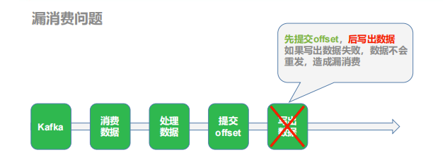</center>

**（2）重复消费（重复计算）**

如果数据计算结果已经存盘了，在 kafka 调整偏移量之前，进程崩溃，那么 kafka 会认为数据没有被消费，进程重启，会重新从旧的偏移量开始，那么数据就会被 2 次消费，又会被存盘，数据就被存了 2 遍，造成数据重复。

<center>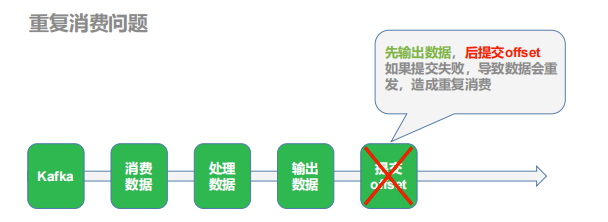</center>

**（3）如果同时解决了数据丢失和数据重复的问题，那么就实现了精确一次消费的语义了。**

目前 Kafka 默认每 5 秒钟做一次自动提交偏移量，这样并不能保证精准一次消费。

```bash
enable.auto.commit 的默认值是 true；就是默认采用自动提交的机制。
auto.commit.interval.ms 的默认值是 5000，单位是毫秒
```


#### 策略一：事务

<center>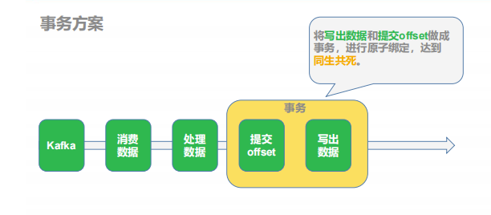</center>

**（1）策略: 利用关系型数据库的事务进行处理**

出现丢失或者重复的问题，核心就是偏移量的提交与数据的保存，不是原子性的。如果能做成要么数据保存和偏移量都成功，要么两个失败，那么就不会出现丢失或者重复了。

这样的话可以把存数据和修改偏移量放到一个事务里。这样就做到前面的成功，如果后面做失败了，就回滚前面那么就达成了原子性，这种情况先存数据还是先修改偏移量没影响。

**（2）好处**

事务方式能够保证精准一次性消费

**（3）问题与限制**

1. 数据必须都要放在一个关系型数据库中，无法使用其他功能强大的 nosql 数据库；
2. 事务本身性能不好；
3. 如果保存的数据量较大一个数据库节点不够，多个节点的话，还要考虑分布式事务的问题。分布式事务会带来管理的复杂性，一般企业不选择使用，有的企业会把分布式事务变成本地事务，例如把 Executor 上的数据通过 rdd.collect 算子提取到 Driver 端，由Driver 端统一写入数据库，这样会将分布式事务变成本地事务的单线程操作，降低了写入的吞吐量。 

**（4）使用场景**

数据足够少（通常经过聚合后的数据量都比较小，明细数据一般数据量都比较大），并且支持事务的数据库。 


#### 策略二：后置提交offset+幂等方案

<center>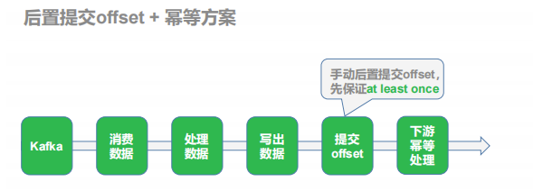</center>

**（1）策略:手动提交偏移量 + 幂等性处理**

我们知道如果能够同时解决数据丢失和数据重复问题，就等于做到了精确一次消费。那就各个击破

首先解决数据丢失问题，办法就是要等数据保存成功后再提交偏移量，所以就必须手工来控制偏移量的提交时机。

但是如果数据保存了，没等偏移量提交进程挂了，数据会被重复消费。怎么办？那就要把数据的保存做成幂等性保存。即同一批数据反复保存多次，数据不会翻倍，保存一次和保存一百次的效果是一样的。如果能做到这个，就达到了幂等性保存，就不用担心数据会重复了。

**（2）难点**

话虽如此，在实际的开发中手动提交偏移量其实不难，难的是幂等性的保存，有的时候并不一定能保证，这个需要看使用的数据库，如果数据库本身不支持幂等性操作，那只能优先保证的数据不丢失，数据重复难以避免，即只保证了至少一次消费的语义。

一般有主键的数据库都支持幂等性操作 upsert。 

**（3）使用场景**

处理数据较多，或者数据保存在不支持事务的数据库上。


#### **手动提交偏移流程**

**（1）偏移量保存在哪**

kafka 0.9版本以后consumer的偏移量是保存在kafka的**__consumer_offsets**主题中。但是如果用这种方式管理偏移量，有一个限制就是在提交偏移量时，数据流的元素结构不能发生转变，即**提交偏移量时数据流，必须是 InputDStream[ConsumerRecord[String, String]]**这种结构。但是在实际计算中，数据难免发生转变，或聚合，或关联，一旦发生转变，就无法在利用以下语句进行偏移量的提交：

```scala
xxDstream.asInstanceOf[CanCommitOffsets].commitAsync(offsetRanges)
```

因为 offset 的存储于 **HasOffsetRanges**，只有 kafkaRDD 继承了他，所以假如我们对KafkaRDD 进行了转化之后，其它 RDD 没有继承 HasOffsetRanges，所以就无法再获取 offset了。

**所以实际生产中通常会利用 ZooKeeper,Redis,Mysql 等工具手动对偏移量进行保存**。


**（2）流程**

<center>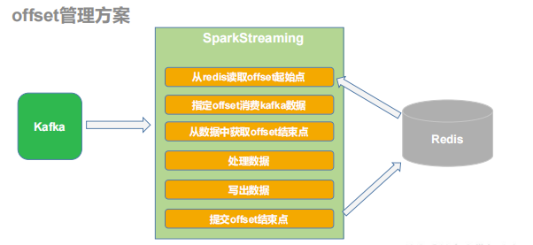</center>


#### **代码实现**

**（1）在** **config.properties** **中添加** **redis** **的连接配置**

```properties
#kafka
kafka.bootstrap-servers=192.168.6.134:9092

#redis
redis.host=192.168.6.134
redis.port=6379
redis.pwd = root
```

**（2）添加 Redis 工具类**

```scala
object MyRedisUtils {
  var jedisPool : JedisPool = null
  def getJedisFromPool(): Jedis = {
    if (jedisPool == null){
      //创建连接池对象
      val jedisPoolConfig = new JedisPoolConfig()
      jedisPoolConfig.setMaxTotal(100) //最大连接数
      jedisPoolConfig.setMaxIdle(20) //最大空闲
      jedisPoolConfig.setMinIdle(20) //最小空闲
      jedisPoolConfig.setBlockWhenExhausted(true) //忙碌时是否等待
      jedisPoolConfig.setMaxWaitMillis(5000) //忙碌时等待时长 毫秒
      jedisPoolConfig.setTestOnBorrow(true) //每次获得连接的进行测试

      val host:String = MyPropsUtils(MyConfig.REDIS_HOST)
      val port:String = MyPropsUtils(MyConfig.REDIS_PORT)
      val pwd:String = MyPropsUtils(MyConfig.REDIS_PWD)

      jedisPool = new JedisPool(jedisPoolConfig,host,port.toInt,5000,pwd)
    }
    jedisPool.getResource
  }
}
```


**（3）添加偏移量工具类**

```scala
/**
 * Offset管理工具类，用于往redis中存储和读取offset
 * 管理方案:
 *   1.  后置提交偏移量  ->  手动控制偏移量提交
 *   2.  手动控制偏移量提交 ->  SparkStreaming提供了手动提交方案，但是我们不能用，因为我们会对DStream的结构进行转换.
 *   3.  手动的提取偏移量维护到redis中
 *         -> 从kafka中消费到数据,先提取偏移量
 *         -> 等数据成功写出后，将偏移量存储到redis中
 *         -> 从kafka中消费数据之前，先到redis中读取偏移量， 使用读取到的偏移量到kakfa中消费数据
 *
 *   4. 手动的将偏移量存储到redis中，每次消费数据需要使用存储的offset进行消费，每次消费数据后，要将本次消费的offset存储到redis中。
 */
object MyOffsetUtils {

    /**
   * 往Redis中存储offset
   * 问题： 存的offset从哪来？
   *            从消费到的数据中提取出来的，传入到该方法中。
   *            offsetRanges: Array[OffsetRange]
   *        offset的结构是什么？
   *            Kafka中offset维护的结构
   *               groupId + topic + partition => offset
   *            从传入进来的offset中提取关键信息
   *        在redis中怎么存?
   *          类型: hash
   *          key : groupId + topic
   *          value: partition - offset  ， partition - offset 。。。。
   *          写入API: hset / hmset
   *          读取API: hgetall
   *          是否过期: 不过期
   */
    def saveOffset(topic :String,groupId :String,offsetRanges: Array[OffsetRange]): Unit ={
        if(offsetRanges!=null && offsetRanges.length>0){
            val offsets : util.HashMap[String,String] = new util.HashMap[String,String]()
            for (offsetRange <- offsetRanges){
                val partition:Int = offsetRange.partition
                val endoffset:Long = offsetRange.untilOffset
                offsets.put(partition.toString,endoffset.toString)
            }
            println("提交offset: " + offsets)
            val jedis:Jedis = MyRedisUtils.getJedisFromPool()
            val redisKey:String = s"offsets:$topic:$groupId"
            jedis.hset(redisKey,offsets)
            jedis.close()
        }
    }

    /**
   * 从Redis中读取存储的offset
   *
   * 问题:
   *    如何让SparkStreaming通过指定的offset进行消费?
   *
   *    SparkStreaming要求的offset的格式是什么?
   *                Map[TopicPartition ,Long  ]
   */

    def readOffset(topic: String, groupId : String ):  Map[TopicPartition ,Long  ] ={
        val jedis: Jedis = MyRedisUtils.getJedisFromPool()
        val redisKey : String = s"offsets:$topic:$groupId"
        val offsets: util.Map[String, String] = jedis.hgetAll(redisKey)
        println("读取到offset: " + offsets)
        val results: mutable.Map[TopicPartition, Long] = mutable.Map[TopicPartition ,Long ]()
        //将java的map转换成scala的map进行迭代
        import scala.collection.JavaConverters._
        for ((partition,offset) <- offsets.asScala) {
            val tp: TopicPartition = new TopicPartition(topic,partition.toInt)
            results.put(tp, offset.toLong)
        }
        jedis.close()
        results.toMap
    }
}
```


**（4）修补主程序的代码**

```scala
object OdsBaseLogApp {

    def main(args :Array[String]): Unit ={
        //1. 准备实时环境
        //TODO 注意并行度与Kafka中topic的分区个数的对应关系
        val sparkConf :SparkConf = new SparkConf().setAppName("ods_base_log_app").setMaster("local[3]")
        val ssc: StreamingContext = new StreamingContext(sparkConf,Seconds(5))

        //2. 从kafka中消费数据
        val topicName : String = "ODS_BASE_LOG_1018"  //对应生成器配置中的主题名
        val groupId : String = "ODS_BASE_LOG_GROUP_1018"

        //    val kafkaDStream : InputDStream[ConsumerRecord[String,String]]= MyKafkaUtils.getKafkaDStream(ssc, topicName, groupId)
        //    kafkaDStream.print(100)
        //TODO 从redis中读取offset，指定offset进行消费
        val offsets:Map[TopicPartition,Long]= MyOffsetUtils.readOffset(topicName, groupId)
        var kafkaDStream : InputDStream[ConsumerRecord[String,String]] = null
        if (offsets!=null && offsets.nonEmpty){
            //指定offset进行消费
            kafkaDStream = MyKafkaUtils.getKafkaDStream(ssc,topicName,groupId,offsets)
        }else{
            //默认offset进行消费
            kafkaDStream = MyKafkaUtils.getKafkaDStream(ssc, topicName, groupId)
        }


        // TODO 补充: 从当前消费到的数据中提取offsets , 不对流中的数据做任何处理.
        var  offsetRanges: Array[OffsetRange] = null
        val offsetRangesDStream: DStream[ConsumerRecord[String, String]] = kafkaDStream.transform(
            rdd => {
                offsetRanges = rdd.asInstanceOf[HasOffsetRanges].offsetRanges  // 在哪里执行? driver
                rdd
            }
        )

        //kafkaDStream.print(100)
        //3. 处理数据
        //3.1 转换数据结构
        val jsonObjDStream: DStream[JSONObject] = offsetRangesDStream.map(
            consumerRecord => {
                //获取ConsumerRecord中的value,value就是日志数据
                val log: String = consumerRecord.value()
                //转换成Json对象
                val jsonObj: JSONObject = JSON.parseObject(log)
                //返回
                jsonObj
            }
        )
        // jsonObjDStream.print(1000)

        //3.2 分流
        // 日志数据：
        //   页面访问数据
        //      公共字段
        //      页面数据
        //      曝光数据
        //      事件数据
        //      错误数据
        //   启动数据
        //      公共字段
        //      启动数据
        //      错误数据
        val DWD_PAGE_LOG_TOPIC : String = "DWD_PAGE_LOG_TOPIC_1018"  // 页面访问
        val DWD_PAGE_DISPLAY_TOPIC : String = "DWD_PAGE_DISPLAY_TOPIC_1018" //页面曝光
        val DWD_PAGE_ACTION_TOPIC : String = "DWD_PAGE_ACTION_TOPIC_1018" //页面事件
        val DWD_START_LOG_TOPIC : String = "DWD_START_LOG_TOPIC_1018" // 启动数据
        val DWD_ERROR_LOG_TOPIC : String = "DWD_ERROR_LOG_TOPIC_1018" // 错误数据
        //分流规则:
        // 错误数据: 不做任何的拆分， 只要包含错误字段，直接整条数据发送到对应的topic
        // 页面数据: 拆分成页面访问， 曝光， 事件 分别发送到对应的topic
        // 启动数据: 发动到对应的topic

        jsonObjDStream.foreachRDD(
            rdd => {

                rdd.foreachPartition(
                    jsonObjIter => {
                        for (jsonObj <- jsonObjIter) {
                            //分流过程
                            //分流错误数据
                            val errObj: JSONObject = jsonObj.getJSONObject("err")
                            if(errObj != null){
                                //将错误数据发送到 DWD_ERROR_LOG_TOPIC
                                MyKafkaUtils.send(DWD_ERROR_LOG_TOPIC ,  jsonObj.toJSONString )
                            }else{
                                // 提取公共字段
                                val commonObj: JSONObject = jsonObj.getJSONObject("common")
                                val ar: String = commonObj.getString("ar")
                                val uid: String = commonObj.getString("uid")
                                val os: String = commonObj.getString("os")
                                val ch: String = commonObj.getString("ch")
                                val isNew: String = commonObj.getString("is_new")
                                val md: String = commonObj.getString("md")
                                val mid: String = commonObj.getString("mid")
                                val vc: String = commonObj.getString("vc")
                                val ba: String = commonObj.getString("ba")
                                //提取时间戳
                                val ts: Long = jsonObj.getLong("ts")
                                // 页面数据
                                val pageObj: JSONObject = jsonObj.getJSONObject("page")
                                if(pageObj != null ){
                                    //提取page字段
                                    val pageId: String = pageObj.getString("page_id")
                                    val pageItem: String = pageObj.getString("item")
                                    val pageItemType: String = pageObj.getString("item_type")
                                    val duringTime: Long = pageObj.getLong("during_time")
                                    val lastPageId: String = pageObj.getString("last_page_id")
                                    val sourceType: String = pageObj.getString("source_type")

                                    //封装成PageLog
                                    var pageLog =
                                    PageLog(mid,uid,ar,ch,isNew,md,os,vc,ba,pageId,lastPageId,pageItem,pageItemType,duringTime,sourceType,ts)
                                    //发送到DWD_PAGE_LOG_TOPIC
                                    MyKafkaUtils.send(DWD_PAGE_LOG_TOPIC , JSON.toJSONString(pageLog , new SerializeConfig(true)))

                                    //提取曝光数据
                                    val displaysJsonArr: JSONArray = jsonObj.getJSONArray("displays")
                                    if(displaysJsonArr != null && displaysJsonArr.size() > 0 ){
                                        for(i <- 0 until displaysJsonArr.size()){
                                            //循环拿到每个曝光
                                            val displayObj: JSONObject = displaysJsonArr.getJSONObject(i)
                                            //提取曝光字段
                                            val displayType: String = displayObj.getString("display_type")
                                            val displayItem: String = displayObj.getString("item")
                                            val displayItemType: String = displayObj.getString("item_type")
                                            val posId: String = displayObj.getString("pos_id")
                                            val order: String = displayObj.getString("order")

                                            //封装成PageDisplayLog
                                            val pageDisplayLog =
                                            PageDisplayLog(mid,uid,ar,ch,isNew,md,os,vc,ba,pageId,lastPageId,pageItem,pageItemType,duringTime,sourceType,displayType,displayItem,displayItemType,order,posId,ts)
                                            // 写到 DWD_PAGE_DISPLAY_TOPIC
                                            MyKafkaUtils.send(DWD_PAGE_DISPLAY_TOPIC , JSON.toJSONString(pageDisplayLog , new SerializeConfig(true)))
                                        }
                                    }
                                    //提取事件数据（课下完成）
                                    val actionJsonArr: JSONArray = jsonObj.getJSONArray("actions")
                                    if(actionJsonArr != null && actionJsonArr.size() > 0 ){
                                        for(i <- 0 until actionJsonArr.size()){
                                            val actionObj: JSONObject = actionJsonArr.getJSONObject(i)
                                            //提取字段
                                            val actionId: String = actionObj.getString("action_id")
                                            val actionItem: String = actionObj.getString("item")
                                            val actionItemType: String = actionObj.getString("item_type")
                                            val actionTs: Long = actionObj.getLong("ts")

                                            //封装PageActionLog
                                            var pageActionLog =
                                            PageActionLog(mid,uid,ar,ch,isNew,md,os,vc,ba,pageId,lastPageId,pageItem,pageItemType,duringTime,sourceType,actionId,actionItem,actionItemType,actionTs,ts)
                                            //写出到DWD_PAGE_ACTION_TOPIC
                                            MyKafkaUtils.send(DWD_PAGE_ACTION_TOPIC , JSON.toJSONString(pageActionLog , new SerializeConfig(true)))
                                        }
                                    }
                                }
                                // 启动数据（课下完成）
                                val startJsonObj: JSONObject = jsonObj.getJSONObject("start")
                                if(startJsonObj != null ){
                                    //提取字段
                                    val entry: String = startJsonObj.getString("entry")
                                    val loadingTime: Long = startJsonObj.getLong("loading_time")
                                    val openAdId: String = startJsonObj.getString("open_ad_id")
                                    val openAdMs: Long = startJsonObj.getLong("open_ad_ms")
                                    val openAdSkipMs: Long = startJsonObj.getLong("open_ad_skip_ms")

                                    //封装StartLog
                                    var startLog =
                                    StartLog(mid,uid,ar,ch,isNew,md,os,vc,ba,entry,openAdId,loadingTime,openAdMs,openAdSkipMs,ts)
                                    //写出DWD_START_LOG_TOPIC
                                    MyKafkaUtils.send(DWD_START_LOG_TOPIC , JSON.toJSONString(startLog ,new SerializeConfig(true)))

                                }
                            }
                        }
                        // foreachPartition里面:  Executor段执行， 每批次每分区执行一次
                        //刷写Kafka
                        MyKafkaUtils.flush()
                    }
                )

                /*
        rdd.foreach(
          jsonObj => {
            //foreach里面:  提交offset???   A  executor执行, 每条数据执行一次.
            //foreach里面:  刷写kafka缓冲区??? executor执行, 每条数据执行一次.  相当于是同步发送消息.
          }
        )
         */

                //foreachRDD里面，forech外面: 提交offset??? B  Driver段执行，一批次执行一次（周期性）
                MyOffsetUtils.saveOffset(topicName,groupId,offsetRanges)
                //foreachRDD里面，forech外面: 刷写Kafka缓冲区??? B  Driver段执行，一批次执行一次（周期性） 分流是在executor端完成，driver端做刷写，刷的不是同一个对象的缓冲区.
            }
        )
        // foreachRDD外面:  提交offsets??? C  Driver执行，每次启动程序执行一次.
        // foreachRDD外面:  刷写kafka缓冲区??? C  Driver执行，每次启动程序执行一次.分流是在executor端完成，driver端做刷写，刷的不是同一个对象的缓冲区.
        ssc.start()
        ssc.awaitTermination()

    }

}
```


#### 幂等性操作

目前处理完的数据写到了 kafka,如果程序出现宕机重试，kafka 是没有办法通过唯一性标识实现幂等性识别，但是也没有关系，因为 kafka 中的数据只是用于中间存储,并不会进行统计，所以只要保证不丢失即可，重复数据的幂等性处理可以交给下游处理，只要保证最终统计结果是不会有重复即可。


### 优化：kafka 消息发送问题

#### 缓冲区问题

Kafka 消息的发送分为同步发送和异步发送。 Kafka 默认使用异步发送的方式。Kafka的生产者将消息进行发送时，会先将消息发送到缓冲区中，待缓冲区写满或者到达指定的时间，才会真正的将缓冲区的数据写到 Broker。

假设消息发送到缓冲区中还未写到 Broker，我们认为数据已经成功写给了 Kafka，接下来会手动的提交 offset, **如果 offset 提交成功，但此刻 Kafka 集群突然出现故障。 缓冲区的数据会丢失，最终导致的问题就是数据没有成功写到 Kafka ，而 offset 已经提交，此部分的数据就会被漏掉。**

#### 问题解决 – 策略一

将消息的发送修改为同步发送，保证每条数据都能发送到 Broker。 但带来的问题就是消息是一条一条写给 Broker,会牺牲性能，一般不推荐。

#### **问题解决** **–** **策略二**

**（1）**策略: **在手动提交** **offset** **之前，强制将缓冲区的数据** **flush** **到** **broker**

Kafka 的生产者对象提供了 flush 方法， 可以强制将缓冲区的数据刷到 Broker。 

**（2）修补主程序代码**

上诉代码修改过了。这里不列出来了。


## 业务数据采集和分流

### 整体架构

<center></center

</center>

业务数据库的采集主要是基于对数据库的变化的实时监控。目前市面上的开源产品主要是 **Canal** 和 **Maxwell**。要利用这些工具实时采集数据到 kafka，以备后续处理。

Maxwell 采集的日志数据，默认是放在一个统一的 kafka 的 Topic 中，为了后续方便处理要进行以表为单位拆分到不同 kafka 的 Topic 中。

针对维度数据，要单独保存。通常考虑用 **redis、hbase、mysql、kudu** 等通过唯一键查询性能较快的数据库中。


### Maxwell简介

#### 什么是Maxwell

Maxwell 是由美国 Zendesk 公司开源，用 Java 编写的 MySQL 变更数据抓取软件。它会实时监控 Mysql 数据库的数据变更操作（包括 insert、update、delete），并将变更数据以 JSON格式发送给 Kafka、Kinesi 等流数据处理平台。

官网地址：http://maxwells-daemon.io/

#### MySQL主从复制

**（1）主从复制的应用场景如下**

1. 做数据库的热备：主数据库服务器故障后，可切换到从数据库继续工作。
2. 分离：主数据库只负责业务数据的写入操作，而多个从数据库只负责业务数据的查询工作，在读多写少场景下，可以提高数据库工作效率。

**（2）MySQL主从复制工作原理**

1. Master 主库将数据变更记录，写到二进制日志(binary log)中 
2. Slave 从库向 mysql master 发送 dump 协议，将 master 主库的 binary log events 拷贝到它的中继日志(relay log)
3. Slave 从库读取并回放中继日志中的事件，将改变的数据同步到自己的数据库

<center>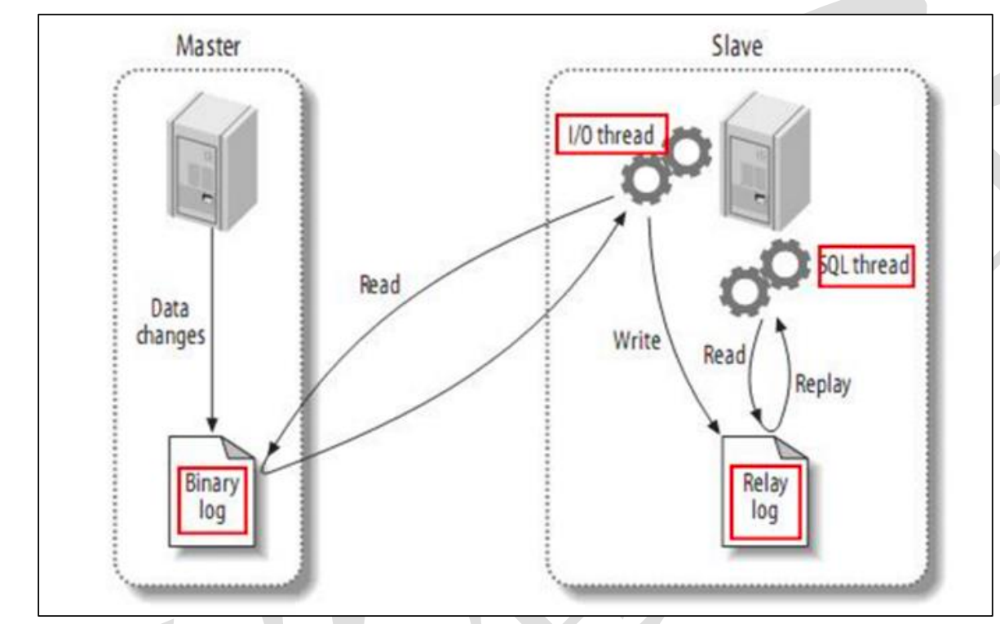</center>


**（3）binlog**

**（1）什么是 binlog**

MySQL 的二进制日志可以说 MySQL 最重要的日志了，它记录了所有的 DDL 和 DML(除了数据查询语句)语句，以事件形式记录，还包含语句所执行的消耗的时间，MySQL 的二进制日志是事务安全型的。

 一般来说开启二进制日志大概会有 1%的性能损耗。

二进制日志包括两类文件：二进制日志索引文件（文件名后缀为.index）用于记录所有的二进制文件，二进制日志文件（文件名后缀为.00000*）记录数据库所有的 DDL 和 DML(除了数据查询语句)语句事件。

**（2**）**binlog 的分类设置**

mysql binlog 的格式有三种，分别是 STATEMENT,MIXED,ROW。

```bash
binlog_format= statement|mixed|row
```

1. statement ：语句级，binlog 会记录每次一执行写操作的语句。相对 row 模式节省空间，但是可能产生不一致性，比如 update tt set create_date=now() 如果用 binlog 日志进行恢复，由于执行时间不同可能产生的数据就不同。

    优点： 节省空间

    缺点： 有可能造成数据不一致。

2. row ：行级， binlog 会记录每次操作后每行记录的变化。

    优点：保持数据的绝对一致性。因为不管 sql 是什么，引用了什么函数，他只记录执行后的效果。

    缺点：占用较大空间

3. mixed：statement 的升级版，一定程度上解决了因为一些情况而造成的 statement 模式不一致问题 。默认还是 statement，在某些情况下譬如：当函数中包含 UUID() 时；包含AUTO_INCREMENT 字段的表被更新时；执行 INSERT DELAYED 语句时；用 UDF 时；会按照 ROW 的方式进行处理

   优点：节省空间，同时兼顾了一定的一致性。

   缺点：还有些极个别情况依旧会造成不一致，另外 statement 和 mixed 对于需要对binlog 的监控的情况都不方便。

**综合上面对比，Maxwell 想做监控分析，选择** **row** **格式比较合适。**


#### **Maxwell** **工作原理**

很简单，就是将自己伪装成 slave，并遵循 MySQL 主从复制的协议，从 master 同步数据。

<center>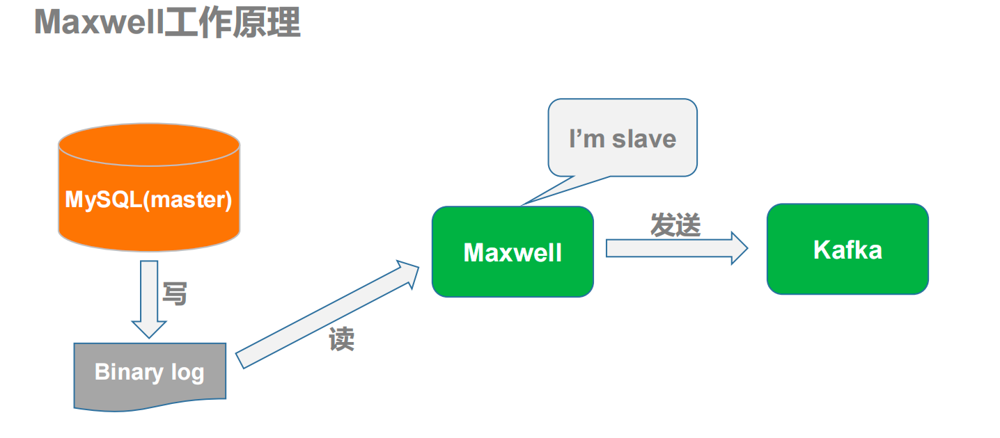</center>


### 采集业务数据

#### **MySQL** **部分**

1. 创建业务数据库（直接使用离线数仓的即可）

   ```sql
   create database gmall;
   ```

   

2. 导入数据表（直接使用离线数仓的即可）

   ```sql
   docker cp gmall.sql mysql:/var
   docker exec -it  mysql /bin/bash
   mysql -uroot -proot gmall < gmall.sql
   ```

   

3. 修改/etc/my.cnf **文件，开启** **binlog**

   ```bash
   server-id=1
   log-bin=mysql-bin
   binlog_format=row
   binlog-do-db=gmall
   ```

4. **重启** **MySQL** **使配置生效**

5. 到**/var/lib/mysql **目录下查看是否生成 **binlog** **文件**


#### 模拟数据

1. **上传** **jar** **和** **properties** **文件上传到/opt/module/db_log目录下**;

2. **修改** **application.properties** **中数据库连接信息**

   ```properties
   spring.datasource.driver-class-name=com.mysql.jdbc.Driver
   spring.datasource.url=jdbc:mysql://192.168.6.134:3306/gmall?characterEncoding=utf-8&useSSL=false&serverTimezone=GMT%2B8&AllowPublicKeyRetrieval=True
   spring.datasource.username=root
   spring.datasource.password=root
   ```

3. **给** **maxwell** **创建用户并赋权限**

   ```sql
    CREATE USER 'maxwell'@'%' IDENTIFIED BY 'maxwell';
    GRANT SELECT, REPLICATION CLIENT, REPLICATION SLAVE ON *.* TO 'maxwell'@'%';
   ```

4. **创建数据库，用于存储** **Maxwell** **运行过程中的一些数据,包括** **binlog** **同步的断点位置等**

   ```sql
   create database maxwell;
   GRANT ALL ON maxwell.* TO 'maxwell'@'%';
   ```

5. **修改** **Maxwell** **配置文件名字**

   ```bash
   mv config.properties.example config.properties
   ```

6. **修改** **Maxwell** **配置文件内容**

   ```bash
   #Maxwell 数 据 发 送 目 的 地 ， 可 选 配 置 有
   stdout|file|kafka|kinesis|pubsub|sqs|rabbitmq|redis producer=kafka
   #目标 Kafka 集群地址
   kafka.bootstrap.servers=192.168.6.134:9092
   # 目 标 Kafka topic ， 可 静 态 配 置 ， 例 如 :maxwell ， 也 可 动 态 配 置 ， 例如：%{database}_%{table}
   kafka_topic=ODS_BASE_DB_M
   #MySQL 相关配置
   host=127.0.0.1
   user=maxwell
   password=maxwell
   jdbc_options=useSSL=false&serverTimezone=Asia/Shanghai
   ```

7. **启动** **Maxwell**

   ```bash
   bin/maxwell --config config.properties --daemon
   ```

   查看进程：
   ```bash
   jps
   ```

8. **启动** **Kafka** **消费客户端测试，查看消费情况**

   ```bash
   kafka-console-consumer.sh  --bootstrap-server 127.0.0.1:9092 --topic ODS_BASE_DB_M
   ```

9. **模拟生成数据**

   ```bash
   java -jar gmall2020-mock-db-2021-01-22.jar
   ```

   <center>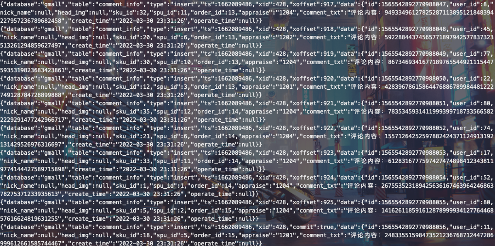</center>

创建一个脚本：

```shell
#!/bin/bash
#根据传递的日期参数修改配置文件的日期
if [ $# -ge 1 ]
then
sed -i "/mock.date/c mock.date: $1" /root/spark实时数仓/数据生成器/业务数据生成器/application.properties
fi
cd /root/spark实时数仓/数据生成器/业务数据生成器;
java -jar gmall2020-mock-db-2021-01-22.jar >/dev/null 2>&1 &
```


### 业务数据消费分流

Maxwell 会追踪整个数据库的变更，把所有的数据变化都发到一个 topic 中了，但是为了后续处理方便，应该**将事实表的数据分流到不同的 topic 中，将维度表的数据写入到 redis中**。

**分流业务代码**

```scala
object OdsbaseDbApp {
  def main(args: Array[String]): Unit = {
    //1. 准备实时环境
    val sparkConf: SparkConf = new SparkConf().setAppName("ods_base_db_app").setMaster("local[4]")
    val ssc: StreamingContext = new StreamingContext(sparkConf , Seconds(5))

    val topicName : String = "ODS_BASE_DB_M"
    val groupId : String = "ODS_BASE_DB_GROUP"

    //2. 从redis中读取偏移量
    val offsets: Map[TopicPartition, Long] = MyOffsetUtils.readOffset(topicName, groupId)

    //3. 从Kafka中消费数据
    var kafkaDStream: InputDStream[ConsumerRecord[String, String]] = null
    if(offsets != null && offsets.nonEmpty){
      kafkaDStream = MyKafkaUtils.getKafkaDStream(ssc,topicName,groupId,offsets)
    }else{
      kafkaDStream = MyKafkaUtils.getKafkaDStream(ssc,topicName,groupId)
    }

    //4. 提取偏移量结束点
    var offsetRanges: Array[OffsetRange] = null
    val offsetRangesDStream : DStream[ConsumerRecord[String, String]] = kafkaDStream.transform(
      rdd => {
        offsetRanges = rdd.asInstanceOf[HasOffsetRanges].offsetRanges
        rdd
      }
    )
    //5. 处理数据
    // 5.1 转换数据结构
    val jsonObjDStream: DStream[JSONObject] = offsetRangesDStream.map(
      consumerRecord => {
        val dataJson: String = consumerRecord.value()
        val jSONObject: JSONObject = JSON.parseObject(dataJson)
        jSONObject
      }
    )
    jsonObjDStream.print(100)

    //5.2 分流


    //事实表清单
    val factTables : Array[String] = Array[String]( "order_info","order_detail" /*缺啥补啥*/)
    //维度表清单
    val dimTables : Array[String] = Array[String]("user_info", "base_province" /*缺啥补啥*/)

    //Redis连接写到哪里???
    // foreachRDD外面:  driver  ，连接对象不能序列化，不能传输
    // foreachRDD里面, foreachPartition外面 : driver  ，连接对象不能序列化，不能传输
    // foreachPartition里面 , 循环外面：executor ， 每分区数据开启一个连接，用完关闭.
    // foreachPartition里面,循环里面:  executor ， 每条数据开启一个连接，用完关闭， 太频繁。
    //
    jsonObjDStream.foreachRDD(
      rdd => {
        rdd.foreachPartition(
          jsonObjIter => {
            // 开启redis连接
            val jedis: Jedis = MyRedisUtils.getJedisFromPool()
            for (jsonObj <- jsonObjIter) {
              // 提取操作类型
              val operType: String = jsonObj.getString("type")

              val opValue: String = operType match {
                case "bootstrap-insert" => "I"
                case "insert" => "I"
                case "update" => "U"
                case "delete" => "D"
                case _ => null
              }
              //判断操作类型: 1. 明确什么操作  2. 过滤不感兴趣的数据
              if(opValue != null){
                // 提取表名
                val tableName: String = jsonObj.getString("table")

                if(factTables.contains(tableName)){
                  //事实数据
                  // 提取数据
                  val data: String = jsonObj.getString("data")
                  // DWD_ORDER_INFO_I  DWD_ORDER_INFO_U  DWD_ORDER_INFO_D
                  val dwdTopicName : String = s"DWD_${tableName.toUpperCase}_${opValue}_1018"
                  MyKafkaUtils.send(dwdTopicName ,  data )

                  //模拟数据延迟
                  if(tableName.equals("order_detail")){
                    Thread.sleep(200)
                  }
                }

                if(dimTables.contains(tableName)){
                  //维度数据
                  // 类型 : string  hash
                  //        hash ： 整个表存成一个hash。 要考虑目前数据量大小和将来数据量增长问题 及 高频访问问题.
                  //        hash :  一条数据存成一个hash.
                  //        String : 一条数据存成一个jsonString.
                  // key :  DIM:表名:ID
                  // value : 整条数据的jsonString
                  // 写入API: set
                  // 读取API: get
                  // 过期:  不过期
                  //提取数据中的id
                  val dataObj: JSONObject = jsonObj.getJSONObject("data")
                  val id: String = dataObj.getString("id")
                  val redisKey : String = s"DIM:${tableName.toUpperCase}:$id"
                  // 在此处开关redis的连接太频繁.
                  //val jedis: Jedis = MyRedisUtils.getJedisFromPool()
                  jedis.set(redisKey, dataObj.toJSONString)
                  //jedis.close()
                }
              }
            }
            //关闭redis连接
            jedis.close()
            //刷新Kafka缓冲区
            MyKafkaUtils.flush()
          }
        )
        //提交offset
        MyOffsetUtils.saveOffset(topicName, groupId,offsetRanges)
      }
    )

    ssc.start()
    ssc.awaitTermination()
  }
}
```

当我们修改user_info中的某行数据，在redis中可以看到变化。

<center>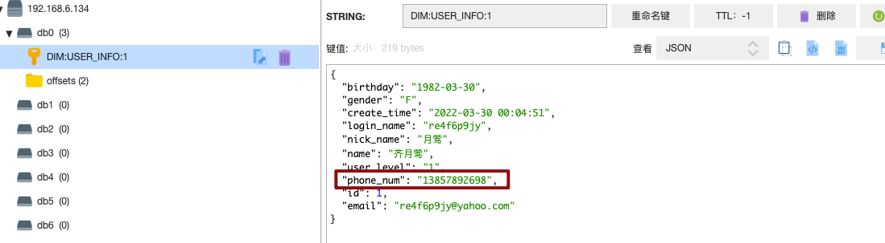</center>


### 历史维度数据初始引导

**Maxwell** **提供了** **bootstrap** **功能来进行历史数据的全量同步，命令如下：**

```bash
bin/maxwell-bootstrap --config config.properties --database gmall --table user_info
```

**Bootstrap** **数据格式**

```bash
{
 "database": "fooDB",
 "table": "barTable",
 "type": "bootstrap-start",
 "ts": 1450557744,
 "data": {}
}{
 "database": "fooDB",
 "table": "barTable",
 "type": "bootstrap-insert",
 "ts": 1450557744,
 "data": {
 "txt": "hello"
 } }{
 "database": "fooDB",
 "table": "barTable",
 "type": "bootstrap-insert",
 "ts": 1450557744,
 "data": {
 "txt": "bootstrap!"
 } }{
 "database": "fooDB",
 "table": "barTable",
 "type": "bootstrap-complete",
 "ts": 1450557744,
 "data": {}
}
```

**注意事项：**

第一条 type 为 bootstrap-start 和最后一条 type 为 bootstrap-complete 的数据，是 bootstrap 开始和结束的标志，不包含数据，中间的 type 为 bootstrap-insert 的数据才包含数据。

一次 bootstrap 输出的所有记录的 ts 都相同，为 bootstrap 开始的时间。


### 动态配置表清单

业务数据表包括了事实表和维度表，而对这两种表要进行不同的处理，在前面我们区分表是用了一个数组：

```scala
//事实表清单
val factTables : Array[String] = Array[String]( "order_info","order_detail" /*缺啥补啥*/)
//维度表清单
val dimTables : Array[String] = Array[String]("user_info", "base_province" /*缺啥补啥*/)
```

但是这样的话每次都需要修改代码，改进的方法：

1. 在一个文件中保存表名称，处理的时候进行动态加载；
2. 将表名称保存到redis中，动态加载。

以redis为例：

```scala
jsonObjDStream.foreachRDD(
    rdd => {
        //如何动态配置表清单???
        // 将表清单维护到redis中，实时任务中动态的到redis中获取表清单.
        // 类型: set
        // key:  FACT:TABLES   DIM:TABLES
        // value : 表名的集合
        // 写入API: sadd
        // 读取API: smembers
        // 过期: 不过期

        val redisFactKeys : String = "FACT:TABLES"
        val redisDimKeys : String = "DIM:TABLES"
        val jedis: Jedis = MyRedisUtils.getJedisFromPool()
        //事实表清单
        val factTables: util.Set[String] = jedis.smembers(redisFactKeys)
        println("factTables: " + factTables)
        //做成广播变量
        val factTablesBC: Broadcast[util.Set[String]] = ssc.sparkContext.broadcast(factTables)

        //维度表清单
        val dimTables: util.Set[String] = jedis.smembers(redisDimKeys)
        println("dimTables: " + dimTables)
        //做成广播变量
        val dimTablesBC: Broadcast[util.Set[String]] = ssc.sparkContext.broadcast(dimTables)
        jedis.close()

        rdd.foreachPartition(
            jsonObjIter => {
                // 开启redis连接
                val jedis: Jedis = MyRedisUtils.getJedisFromPool()
                for (jsonObj <- jsonObjIter) {
                    // 提取操作类型
                    val operType: String = jsonObj.getString("type")

                    val opValue: String = operType match {
                        case "bootstrap-insert" => "I"
                        case "insert" => "I"
                        case "update" => "U"
                        case "delete" => "D"
                        case _ => null
                    }
                    //判断操作类型: 1. 明确什么操作  2. 过滤不感兴趣的数据
                    if(opValue != null){
                        // 提取表名
                        val tableName: String = jsonObj.getString("table")

                        if(factTablesBC.value.contains(tableName)){
                            //事实数据
                            // 提取数据
                            val data: String = jsonObj.getString("data")
                            // DWD_ORDER_INFO_I  DWD_ORDER_INFO_U  DWD_ORDER_INFO_D
                            val dwdTopicName : String = s"DWD_${tableName.toUpperCase}_${opValue}_1018"
                            MyKafkaUtils.send(dwdTopicName ,  data )

                            //模拟数据延迟
                            if(tableName.equals("order_detail")){
                                Thread.sleep(200)
                            }
                        }

                        if(dimTablesBC.value.contains(tableName)){
                            //维度数据
                            // 类型 : string  hash
                            //        hash ： 整个表存成一个hash。 要考虑目前数据量大小和将来数据量增长问题 及 高频访问问题.
                            //        hash :  一条数据存成一个hash.
                            //        String : 一条数据存成一个jsonString.
                            // key :  DIM:表名:ID
                            // value : 整条数据的jsonString
                            // 写入API: set
                            // 读取API: get
                            // 过期:  不过期
                            //提取数据中的id
                            val dataObj: JSONObject = jsonObj.getJSONObject("data")
                            val id: String = dataObj.getString("id")
                            val redisKey : String = s"DIM:${tableName.toUpperCase}:$id"
                            // 在此处开关redis的连接太频繁.
                            //val jedis: Jedis = MyRedisUtils.getJedisFromPool()
                            jedis.set(redisKey, dataObj.toJSONString)
                            //jedis.close()
                        }
                    }
                }
                //关闭redis连接
                jedis.close()
                //刷新Kafka缓冲区
                MyKafkaUtils.flush()
            }
        )
        //提交offset
        MyOffsetUtils.saveOffset(topicName, groupId,offsetRanges)
    }
)
```

用set数据结构保存了每种表的所有信息，读取后并不是直接使用，而是做成一个**广播变量**。当然这里因为数据量比较少，直接使用也是可以的。


### 广播变量

如果我们要在分布式计算里面分发大对象，例如：字典，集合，黑白名单等，这个都会由Driver端进行分发，一般来讲，如果这个变量不是广播变量，那么每个task就会分发一份，这在**task数目十分多的情况下Driver的带宽会成为系统的瓶颈，而且会大量消耗task服务器上的资源**，如果将这个变量声明为广播变量，那么知识每个executor拥有一份，这个executor启动的task会共享这个变量，节省了通信的成本和服务器的资源。

不使用广播变量：

<center></center>

使用广播变量：
<center></center>

注意：

1. 能不能将一个RDD使用广播变量广播出去？不能，因为RDD是不存储数据的。**可以将RDD的结果广播出去。**
2. 广播变量只能在Driver端定义，**不能在Executor端定义。**
3. 在Driver端可以修改广播变量的值，**在Executor端无法修改广播变量的值。**
4. 如果executor端用到了Driver的变量，如果**不使用广播变量在Executor有多少task就有多少Driver端的变量副本。**
5. 如果Executor端用到了Driver的变量，如果**使用广播变量在每个Executor中只有一份Driver端的变量副本。**


>driver向executor传数据考虑两个问题：
>
>1. 能不能传？即能不能序列化？
>2. 传的数据大不大？大的话使用广播变量。


### 数据处理顺序性

在实时计算中，对业务数据的计算，要考虑到数据处理的顺序， 即能否依照数据改变的顺序进行处理。

假设一个场景，如果将某个用户数据的姓名字段进行多次更改，由原先的 A 改为 B 再改为 C，在数据库层面最终的结果为 C， 但是我们能否保证数据经过实时处理后，在 DIM层存储的结果也为 C，可不可能存储的结果为 B。

我们依次审视一下，在实时处理的各个环节中，是否能保证数据的顺序？如果不能保证，是在哪个环节出的问题，最终导致存储的结果不正确。

<center>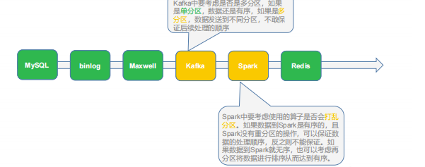</center>

**解决：**

通过分析，目前我们的计算过程中，只有可能在 Kafka 环节出现数据乱序，导致最终存储的结果不正确。如果想要保证数据处理的顺序性，我们可以**将同一条数据的修改发往 topic的同一个分区中**。需要修改 maxwell 的配置文件，指定发送数据到 kafka 时要使用分区键。

修改**config.properties** **文件中的如下配置**：

```properties
# What part of the data do we partition by?
# [database, table, primary_key, transaction_id, thread_id, column]
producer_partition_by=column 

# specify what fields to partition by when using producer_partition_by=column
# column separated list.
#producer_partition_columns=id,foo,bar
producer_partition_columns=id

# when using producer_partition_by=column, partition by this when
# the specified column(s) don't exist.
#producer_partition_by_fallback=database
producer_partition_by_fallback=table
```

- producer_partition_by=column：以某一列进行分区；
- producer_partition_columns=id：以id列进行分区；
- producer_partition_by_fallback=table：如果id列并不存在，则以table进行分区。


## DWD 到 DWS

首先明确的是数据的聚合操作，一律交给 OLAP 来完成，因为 OLAP 数据库的特性都是非常利于数据聚合统计的，可以说这也是 OLAP 的本职工作。

那么在此之前实时计算就要完成一些 OLAP 不是特别方便或者性能并不好的操作，比如 JOIN 操作，比如分组去重(需要开窗)或者复杂的数据计算等等，实际情况还要看 OLAP的选型。那这些工作可以交由实时计算完成。

从 ODS 到 DWD 层主要负责原始数据的整理拆分，形成一个一个的业务事实 topic。 

从 DWD 层到 DWS 层主要负责把单个的业务事实 topic 变为面向统计的事实明细宽表，然后保存到 OLAP 中。

<center>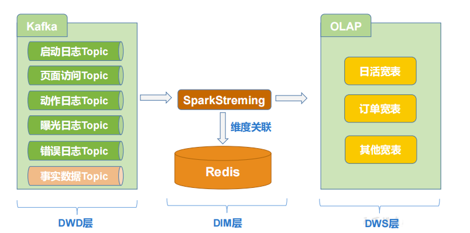</center>

> **我的理解来看，就是将DWD中的日志数据或者业务数据关联一些DIM层的维度数据，又或者业务数据进行join，形成一张包含细致数据的宽表，从而省去了在OLAP数据库中的join操作。**


### 日活宽表

#### 需求举例

（1）当日用户首次登录（日活）分时趋势图

<center>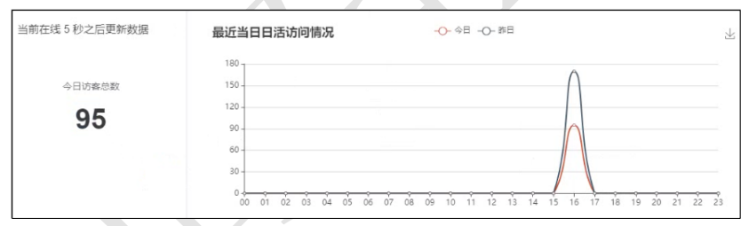</center>

（2）不同渠道柱形对比图

<center>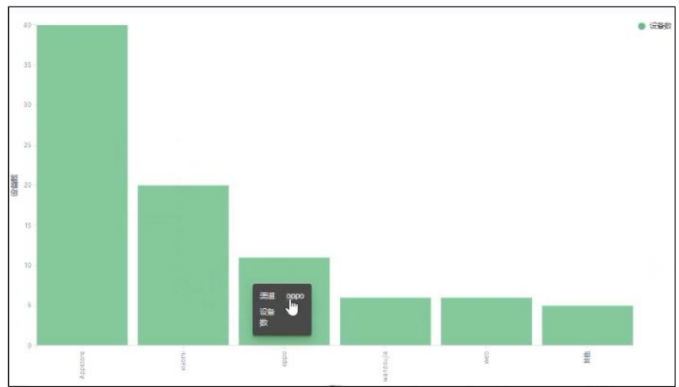</center>


####  任务分析

（1）**去重**

由于日活代表了用户当日的首次访问，因此除了当日的首次访问以外的其他访问，一律需要过滤掉。每个用户每天可能启动多次。要想计算日活，我们只需要把当前用户每天的第一次启动日志获取即可，所以要对启动日志进行去重，相当于做了一次清洗。

实时计算中的去重是一个比较常见的需求，可以有许多方式实现，比如:将状态存在Redis 中；存在关系型数据库中；通过 Spark 自身的 updateStateByKey（checkPoint 小文件等问题比较麻烦、不方便管理、程序无法变更升级）等。

**我们这里结合** **Redis** **实现对当前用户启动日志去重操作**

（2）**维度关联**

由于要针对各种对于不同角度的“日活”分析，而 OLAP 数据库中尽量减少 join 操作，所以在实时计算中要考虑其会被分析的维度，补充响应相应的维度数据，形成宽表。

由于维度数据已经保存在固定容器中了(redis)，所以在实时计算中，维度与事实数据关联并不是通过 join 算子完成。而是在流中查询固定容器来实现维度补充。

（3）**输出到 OLAP中**

把清洗和组合好的宽表数据写入到 OLAP 中。这个部分要注意做到尽可能做到：

- **批量写入**：主要是为了减少 IO 次数提高写入性能，同时也能尽可能减少 OLAP 数据内部的小文件的生成。

- **幂等性写入**：为了保证数据的精确一次消费，通过在实时计算中通过控制提交偏移量的位置避免数据丢失，同时通过幂等性的写入避免重复数据


#### 基本代码

##### bean

```scala
case class DauInfo(
                    //基本的页面访问日志的数据
                    var mid :String,
                    var user_id:String,
                    var province_id:String,
                    var channel:String,
                    var is_new:String,
                    var model:String,
                    var operate_system:String,
                    var version_code:String,
                    var brand : String,
                    var page_id:String ,
                    var page_item:String,
                    var page_item_type:String,
                    var sourceType :String ,
                    var during_time:Long,

                    //用户性别 年龄
                    var user_gender : String ,
                    var user_age : String ,

                    //地区信息
                    var province_name : String ,
                    var province_iso_code: String ,
                    var province_3166_2 :String ,
                    var province_area_code : String,

                    //日期
                    var dt : String ,
                    var hr : String ,
                    var ts : Long
                  ) {

  def this(){
    this(null,null,null,null,null,null,null,null,null,null ,null ,null,null,0L,null,null,null,null,null,null,null,null,0L)
  }
}
```


##### 对象拷贝工具类

```scala
object MyBeanUtils {

    def main(args: Array[String]): Unit = {
        val pageLog: PageLog =
        PageLog("mid1001" , "uid101" , "prov101" , null ,null ,null ,null ,null ,null ,null ,null ,null ,null ,0L ,null ,123456)

        val dauInfo: DauInfo = new DauInfo()
        println("拷贝前: " + dauInfo)

        copyProperties(pageLog,dauInfo)

        println("拷贝后: " + dauInfo)

    }

    /**
    * 将srcObj中属性的值拷贝到destObj对应的属性上.
    */
    def copyProperties(srcObj : AnyRef , destObj: AnyRef): Unit ={
        if(srcObj == null || destObj == null ){
            return
        }
        //获取到srcObj中所有的属性
        val srcFields: Array[Field] = srcObj.getClass.getDeclaredFields

        //处理每个属性的拷贝
        for (srcField <- srcFields) {
            Breaks.breakable{
                //get / set
                // Scala会自动为类中的属性提供get、 set方法
                // get : fieldname()
                // set : fieldname_$eq(参数类型)

                //getMethodName
                var getMethodName : String = srcField.getName
                //setMethodName
                var setMethodName : String = srcField.getName+"_$eq"

                //从srcObj中获取get方法对象，
                val getMethod: Method = srcObj.getClass.getDeclaredMethod(getMethodName)
                //从destObj中获取set方法对象
                // String name;
                // getName()
                // setName(String name ){ this.name = name }
                val setMethod: Method =
                try{
                    destObj.getClass.getDeclaredMethod(setMethodName, srcField.getType)
                }catch{
                    // NoSuchMethodException
                    case ex : Exception =>  Breaks.break()
                }

                //忽略val属性,不做处理
                val destField: Field = destObj.getClass.getDeclaredField(srcField.getName)
                if(destField.getModifiers.equals(Modifier.FINAL)){
                    Breaks.break()
                }
                //调用get方法获取到srcObj属性的值， 再调用set方法将获取到的属性值赋值给destObj的属性
                setMethod.invoke(destObj, getMethod.invoke(srcObj))
            }
        }
    }
}
```


#### 消费数据和去重

日活的统计我们只需要考虑用户的首次访问行为，不同企业判断用户活跃的方式不同，可以通过启动数据或者页面数据来分析，我们采用页面数据来统计日活，页面数据中包含用户所有的访问行为，而**我们只需要首次访问行为，所以可以在每批次的数据中先将包含有 last_page_id 的数据过滤掉， 剩下的数据再与第三方（redis）中所记录的今日访问用户进行比对**。

<center>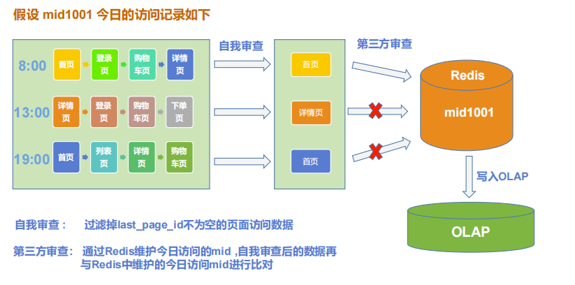</center>

```scala
object DwdDauApp {
    def main(args: Array[String]): Unit = {
        //0.还原状态
        //    revertState()

        //1. 准备实时环境
        val sparkConf: SparkConf = new SparkConf().setAppName("dwd_dau_app").setMaster("local[4]")
        val ssc: StreamingContext = new StreamingContext(sparkConf,Seconds(5))

        //2. 从Redis中读取offset
        val topicName : String = "DWD_PAGE_LOG_TOPIC"
        val groupId : String = "DWD_DAU_GROUP"
        val offsets: Map[TopicPartition, Long] = MyOffsetUtils.readOffset(topicName, groupId)

        //3. 从Kafka中消费数据
        var kafkaDStream: InputDStream[ConsumerRecord[String, String]] = null
        if(offsets != null && offsets.nonEmpty){
            kafkaDStream = MyKafkaUtils.getKafkaDStream(ssc,topicName,groupId,offsets)
        }else {
            kafkaDStream = MyKafkaUtils.getKafkaDStream(ssc,topicName,groupId)
        }

        //4. 提取offset结束点
        var offsetRanges: Array[OffsetRange] = null
        val offsetRangesDStream: DStream[ConsumerRecord[String, String]] = kafkaDStream.transform(
            rdd => {
                offsetRanges = rdd.asInstanceOf[HasOffsetRanges].offsetRanges
                rdd
            }
        )
        //5. 处理数据
        // 5.1 转换结构
        val pageLogDStream: DStream[PageLog] = offsetRangesDStream.map(
            consumerRecord => {
                val value: String = consumerRecord.value()
                val pageLog: PageLog = JSON.parseObject(value, classOf[PageLog])
                pageLog
            }
        )

        pageLogDStream.cache()
        pageLogDStream.foreachRDD(
            rdd => println("自我审查前: " + rdd.count())
        )
        //5.2 去重
        // 自我审查: 将页面访问数据中last_page_id不为空的数据过滤掉
        val filterDStream: DStream[PageLog] = pageLogDStream.filter(
            pageLog => pageLog.last_page_id == null
        )
        filterDStream.cache()
        filterDStream.foreachRDD(
            rdd => {
                println("自我审查后: " + rdd.count())
                println("----------------------------")
            }
        )

        // 第三方审查:  通过redis将当日活跃的mid维护起来,自我审查后的每条数据需要到redis中进行比对去重
        // redis中如何维护日活状态
        // 类型:    set
        // key :    DAU:DATE
        // value :  mid的集合
        // 写入API: sadd
        // 读取API: smembers
        // 过期:  24小时

        //filterDStream.filter()  // 每条数据执行一次. redis的连接太频繁.
        // [A, B , C ] => [ AA ,BB ]
        val redisFilterDStream: DStream[PageLog] = filterDStream.mapPartitions(
            pageLogIter => {
                val pageLogList: List[PageLog] = pageLogIter.toList
                println("第三方审查前: " + pageLogList.size)

                //存储要的数据
                val pageLogs: ListBuffer[PageLog] = ListBuffer[PageLog]()
                val sdf: SimpleDateFormat = new SimpleDateFormat("yyyy-MM-dd")
                val jedis: Jedis = MyRedisUtils.getJedisFromPool()
                for (pageLog <- pageLogList) {
                    // 提取每条数据中的mid (我们日活的统计基于mid， 也可以基于uid)
                    val mid: String = pageLog.mid

                    //获取日期 , 因为我们要测试不同天的数据，所以不能直接获取系统时间.
                    val ts: Long = pageLog.ts
                    val date: Date = new Date(ts)
                    val dateStr: String = sdf.format(date)
                    val redisDauKey: String = s"DAU:$dateStr"

                    //redis的判断是否包含操作
                    /*
                      下面代码在分布式环境中，存在并发问题， 可能多个并行度同时进入到if中,导致最终保留多条同一个mid的数据.
                      // list
                      val mids: util.List[String] = jedis.lrange(redisDauKey, 0 ,-1)
                      if(!mids.contains(mid)){
                        jedis.lpush(redisDauKey , mid )
                        pageLogs.append(pageLog)
                      }
                      // set
                      val setMids: util.Set[String] = jedis.smembers(redisDauKey)
                      if(!setMids.contains(mid)){
                        jedis.sadd(redisDauKey,mid)
                        pageLogs.append(pageLog)
                      }

                     */
                    val isNew: lang.Long = jedis.sadd(redisDauKey, mid) // 判断包含和写入实现了原子操作.
                    if (isNew == 1L) {
                        pageLogs.append(pageLog)
                    }
                }
                jedis.close()
                println("第三方审查后: " + pageLogs.size)
                pageLogs.iterator
            }
        )
        //redisFilterDStream.print()
        ssc.start()
        ssc.awaitTermination()
    }
}
```


#### 维度合并

由于要针对各种对于不同角度的“日活”分析，而 **OLAP 数据库中尽量减少 join 操作，所以在实时计算中要考虑其会被分析的维度，补充相应的维度数据，形成宽表。**

由于维度数据已经保存在固定容器中了，所以在实时计算中，维度与事实数据关联并不是通过 join 算子完成。而是在流中查询固定容器（redis/mysql/hbase）来实现维度补充。

<center>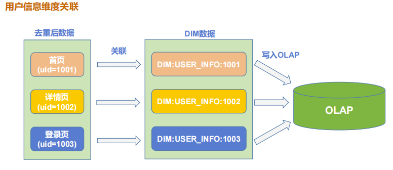</center>

```scala
object DwdDauApp {
  def main(args: Array[String]): Unit = {
 	...

    //5.3 维度关联
    val dauInfoDStream: DStream[DauInfo] = redisFilterDStream.mapPartitions(
      pageLogIter => {
        val dauInfos: ListBuffer[DauInfo] = ListBuffer[DauInfo]()
        val sdf: SimpleDateFormat = new SimpleDateFormat("yyyy-MM-dd HH:mm:ss")
        val jedis: Jedis = MyRedisUtils.getJedisFromPool()
        for (pageLog <- pageLogIter) {
          val dauInfo: DauInfo = new DauInfo()
          //1. 将pagelog中以后的字段拷贝到DauInfo中
          //笨办法: 将pageLog中的每个字段的值挨个提取，赋值给dauInfo中对应的字段。
          //dauInfo.mid = pageLog.mid
          //好办法: 通过对象拷贝来完成.
          MyBeanUtils.copyProperties(pageLog, dauInfo)

          //2. 补充维度
          //2.1  用户信息维度
          val uid: String = pageLog.user_id
          val redisUidkey: String = s"DIM:USER_INFO:$uid"
          val userInfoJson: String = jedis.get(redisUidkey)
          val userInfoJsonObj: JSONObject = JSON.parseObject(userInfoJson)
          //提取性别
          val gender: String = userInfoJsonObj.getString("gender")
          //提取生日
          val birthday: String = userInfoJsonObj.getString("birthday") // 1976-03-22
          //换算年龄
          val birthdayLd: LocalDate = LocalDate.parse(birthday)
          val nowLd: LocalDate = LocalDate.now()
          val period: Period = Period.between(birthdayLd, nowLd)
          val age: Int = period.getYears

          //补充到对象中
          dauInfo.user_gender = gender
          dauInfo.user_age = age.toString

          //2.2  地区信息维度
          // redis中:
          // 现在: DIM:BASE_PROVINCE:1
          // 之前: DIM:BASE_PROVINCE:110000
          val provinceID: String = dauInfo.province_id
          val redisProvinceKey: String = s"DIM:BASE_PROVINCE:$provinceID"
          val provinceJson: String = jedis.get(redisProvinceKey)
          val provinceJsonObj: JSONObject = JSON.parseObject(provinceJson)
          val provinceName: String = provinceJsonObj.getString("name")
          val provinceIsoCode: String = provinceJsonObj.getString("iso_code")
          val province3166: String = provinceJsonObj.getString("iso_3166_2")
          val provinceAreaCode: String = provinceJsonObj.getString("area_code")

          //补充到对象中
          dauInfo.province_name = provinceName
          dauInfo.province_iso_code = provinceIsoCode
          dauInfo.province_3166_2 = province3166
          dauInfo.province_area_code = provinceAreaCode

          //2.3  日期字段处理
          val date: Date = new Date(pageLog.ts)
          val dtHr: String = sdf.format(date)
          val dtHrArr: Array[String] = dtHr.split(" ")
          val dt: String = dtHrArr(0)
          val hr: String = dtHrArr(1).split(":")(0)
          //补充到对象中
          dauInfo.dt = dt
          dauInfo.hr = hr

          dauInfos.append(dauInfo)
        }

        jedis.close()
        dauInfos.iterator
      }
    )
    dauInfoDStream.print(100)
    ssc.start()
    ssc.awaitTermination()
  }
}
```


#### es工具类


#### 写入es

（1）**建立索引模板**

```json
PUT _template/gmall_dau_info_template
{
    "index_patterns": ["gmall_dau_info*"], 
    "settings": { 
        "number_of_shards": 3
    },
    "aliases" : { 
        "{index}-query": {},
        "gmall_dau_info_all":{}
    },
    "mappings": {
        "properties":{
            "mid":{
                "type":"keyword"
            },
            "user_id":{
                "type":"keyword"
            },
            "province_id":{
                "type":"keyword"
            },
            "channel":{
                "type":"keyword"
            },
            "is_new":{
                "type":"keyword"
            },
            "model":{
                "type":"keyword"
            },
            "operate_system":{
                "type":"keyword"
            },
            "version_code":{
                "type":"keyword"
            },
            "page_id":{
                "type":"keyword"
            },
            "page_item":{
                "type":"keyword"
            },
            "page_item_type":{
                "type":"keyword"
            },
            "during_time":{
                "type":"long"
            },
            "user_gender":{
                "type":"keyword"
            },
            "user_age":{
                "type":"integer"
            },
            "province_name":{
                "type":"keyword"
            },
            "province_iso_code":{
                "type":"keyword"
            },
            "province_3166_2":{
                "type":"keyword"
            },
            "province_area_code":{
                "type":"keyword"
            },
            "dt":{
                "type":"keyword"
            },
            "hr":{
                "type":"keyword"
            },
            "ts":{
                "type":"date"
            } 
        }
    } }
```

（2）业务代码

主程序调用工具类批量写入 ES，其实我们前面已经使用 Redis 进行了去重操作，基本上是可以保证幂等性的。如果更严格的保证幂等性，那我们在批量向 ES 写数据的时候，指定 Index 的 id 即可。

```scala
//写入到OLAP中
//按照天分割索引，通过索引模板控制mapping、settings、aliases等.
//准备ES工具类
dauInfoDStream.foreachRDD(
    rdd => {
        rdd.foreachPartition(
            dauInfoIter => {
                val docs: List[(String, DauInfo)] =
                dauInfoIter.map( dauInfo=> (dauInfo.mid , dauInfo)).toList
                if(docs.size >  0 ){
                    // 索引名
                    // 如果是真实的实时环境，直接获取当前日期即可.
                    // 因为我们是模拟数据，会生成不同天的数据.
                    // 从第一条数据中获取日期
                    val head: (String, DauInfo) = docs.head
                    val ts: Long = head._2.ts
                    val sdf: SimpleDateFormat = new SimpleDateFormat("yyyy-MM-dd")
                    val dateStr: String = sdf.format(new Date(ts))
                    val indexName : String = s"gmall_dau_info_1018_$dateStr"
                    //写入到ES中
                    MyEsUtils.bulkSave(indexName , docs)
                }
            }
        )
        //提交offset
        MyOffsetUtils.saveOffset(topicName, groupId , offsetRanges)
    }
)
```


#### 状态数据还原

想象一个比较极端的情况， 如果某个用户某天的首次访问数据写入 redis 后， 接下来在写入到 es 的过程中,程序挂掉。 会出现什么问题 ?

程序挂掉，偏移量还未提交，重启后会触发数据的重试，但是因为 redis 中记录了相关的数据，所以该数据会被过滤掉。因此此数据，就再也无法进入 es，也就意味着丢失。

这个问题的本质就是，**状态数据与最终数据库的数据以及偏移量，没有形成原子性事务造成的**。

当然可以通过事务数据库的方式解决该问题，而**我们的项目中没有选择使用支持事务的数据库**，例如 MySQL 等。在既有的环境下我们依然有很多破解方案，例如**进行状态还原，在启动程序前，将 ES 中已有的数据的 mid 提取出来，覆盖到 Redis 中，这样就能保证Redis 和 ES 数据的同步**。

```scala
/**
   * 状态还原
   *
   * 在每次启动实时任务时， 进行一次状态还原。 以ES为准, 将所以的mid提取出来，覆盖到Redis中.
   */

def revertState(): Unit ={
    //从ES中查询到所有的mid
    val date: LocalDate = LocalDate.now()
    val indexName : String = s"gmall_dau_info_1018_$date"
    val fieldName : String = "mid"
    val mids: List[ String ] = MyEsUtils.searchField(indexName , fieldName)
    //删除redis中记录的状态（所有的mid）
    val jedis: Jedis = MyRedisUtils.getJedisFromPool()
    val redisDauKey : String = s"DAU:$date"
    jedis.del(redisDauKey)
    //将从ES中查询到的mid覆盖到Redis中
    if(mids != null && mids.size > 0 ){
        /*for (mid <- mids) {
        jedis.sadd(redisDauKey , mid )
      }*/
        val pipeline: Pipeline = jedis.pipelined()
        for (mid <- mids) {
            pipeline.sadd(redisDauKey , mid )  //不会直接到redis执行
        }

        pipeline.sync()  // 到redis执行
    }

    jedis.close()
}
```

**调整** **ES** **参数**

此方法由于需要把当日全部 mid 取出，会受到 es 默认的结果返回数限制。需要修改配置扩大返回结果数，如下：

```json
PUT /_settings
{
 "index.max_result_window" :"5000000"
}
```

**修补主程序，在整个程序加载数据前进行状态还原**

```scala
def main(args: Array[String]): Unit = {
 //0.还原状态
 revertDauState()
    
 //1. 准备实时环境
 ...
 //2. 从Redis中读取offset
 ...
 ...
}
```


### 订单业务宽表

#### 需求举例

（1）订单热力图

<center></center>

（2）订单交易分析

<center>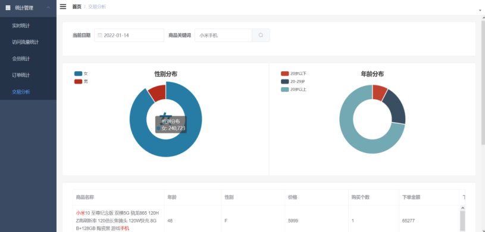</center>


#### 任务分析

由于在很多 OLAP 数据库对聚合过滤都是非常强大，但是大表间的关联都不是长项。所以在数据进入 OLAP 前，尽量提前把数据关联组合好，不要在查询的时候临时进行 Join操作。所谓提前关联好，在实时计算中进行流 Join。

<center>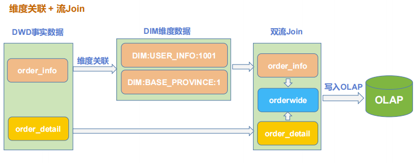</center>

这里注意一下**双流join**，指的是**流与流之间的合并，通常是几乎同时产生的事实表的关联**。 


#### 基本代码-bean

（1）**OrderInfo , 封装订单表数据**

```scala
case class OrderInfo(
                      id: Long =0L,
                      province_id: Long=0L,
                      order_status: String=null,
                      user_id: Long=0L,
                      total_amount:  Double=0D,
                      activity_reduce_amount: Double=0D,
                      coupon_reduce_amount: Double=0D,
                      original_total_amount: Double=0D,
                      feight_fee: Double=0D,
                      feight_fee_reduce: Double=0D,
                      expire_time: String =null,
                      refundable_time:String =null,
                      create_time: String=null,
                      operate_time: String=null,

                      var create_date: String=null, // 把其他字段处理得到
                      var create_hour: String=null,

                      var province_name:String=null,//查询维度表得到
                      var province_area_code:String=null,
                      var province_3166_2_code:String=null,
                      var province_iso_code:String=null,

                      var user_age :Int=0, //查询维度表得到
                      var user_gender:String=null

                    ) {

}
```


（2）**OrderDetail，封装订单详情数据**

```scala
case class OrderDetail(
                        id : Long ,
                        order_id :Long ,
                        sku_id : Long ,
                        order_price : Double ,
                        sku_num : Long ,
                        sku_name :String ,
                        create_time : String ,
                        split_total_amount: Double = 0D,
                        split_activity_amount: Double =0D,
                        split_coupon_amount:Double = 0D

                      ) {

}
```


（3）**OrderWide，订单宽表**

```scala
case class OrderWide(
                      var  detail_id: Long =0L,
                      var  order_id:Long=0L,
                      var  sku_id: Long=0L,
                      var  order_price: Double=0D,
                      var  sku_num:Long=0L,
                      var  sku_name: String=null,
                      var  split_total_amount:Double=0D,
                      var  split_activity_amount:Double=0D,
                      var  split_coupon_amount:Double=0D,

                      var  province_id: Long=0L,
                      var  order_status: String=null,
                      var  user_id: Long=0L,
                      var  total_amount:  Double=0D,
                      var  activity_reduce_amount: Double=0D,
                      var  coupon_reduce_amount: Double=0D,
                      var  original_total_amount: Double=0D,
                      var  feight_fee: Double=0D,
                      var  feight_fee_reduce: Double=0D,
                      var  expire_time: String =null,
                      var  refundable_time:String =null,
                      var  create_time: String=null,
                      var operate_time: String=null,
                      var create_date: String=null,
                      var create_hour: String=null,

                      var province_name:String=null,
                      var province_area_code:String=null,
                      var province_3166_2_code:String=null,
                      var province_iso_code:String=null,

                      var user_age :Int=0,
                      var user_gender:String=null

                    ) {

  def this(orderInfo : OrderInfo ,orderDetail: OrderDetail){
    this
    mergeOrderInfo(orderInfo)
    mergeOrderDetail(orderDetail)
  }

  def mergeOrderInfo(orderInfo: OrderInfo): Unit ={
    if(orderInfo != null ){
      MyBeanUtils.copyProperties(orderInfo,this)
      this.order_id = orderInfo.id
    }
  }

  def mergeOrderDetail (orderDetail: OrderDetail): Unit ={
    if(orderDetail != null ){
      MyBeanUtils.copyProperties(orderDetail,this)
      this.detail_id = orderDetail.id
    }
  }

}
```


#### 消费数据

```scala
object DwdOrderApp {

  def main(args: Array[String]): Unit = {
    //1. 准备环境
    val sparconf: SparkConf = new SparkConf().setAppName("dwd_order_app").setMaster("local[4]")
    val ssc: StreamingContext = new StreamingContext(sparconf , Seconds(5))

    //2.读取offset
    //order_info
    val orderInfoTopicName : String = "DWD_ORDER_INFO_I_1018"
    val orderInfoGroup : String = "DWD_ORDER_INFO:GROUP"
    val orderInfoOffsets: Map[TopicPartition, Long] =
        MyOffsetUtils.readOffset(orderInfoTopicName , orderInfoGroup)
    //order_detail
    val orderDetailTopicName : String = "DWD_ORDER_DETAIL_I_1018"
    val orderDetailGroup : String = "DWD_ORDER_DETAIL_GROUP"
    val orderDetailOffsets: Map[TopicPartition, Long] =
      MyOffsetUtils.readOffset(orderDetailTopicName ,orderDetailGroup)

    //3. 从Kafka中消费数据
    // order_info
    var orderInfoKafkaDStream: InputDStream[ConsumerRecord[String, String]] = null
    if(orderInfoOffsets != null && orderInfoOffsets.nonEmpty){
      orderInfoKafkaDStream = MyKafkaUtils.getKafkaDStream(ssc,orderInfoTopicName, orderInfoGroup,orderInfoOffsets)
    }else{
      orderInfoKafkaDStream = MyKafkaUtils.getKafkaDStream(ssc,orderInfoTopicName, orderInfoGroup)
    }

    //order_detail
    var orderDetailKafkaDStream: InputDStream[ConsumerRecord[String, String]] = null
    if(orderDetailOffsets!= null && orderDetailOffsets.nonEmpty){
      orderDetailKafkaDStream = MyKafkaUtils.getKafkaDStream(ssc,orderDetailTopicName,orderDetailGroup,orderDetailOffsets)
    }else{
      orderDetailKafkaDStream = MyKafkaUtils.getKafkaDStream(ssc,orderDetailTopicName,orderDetailGroup)
    }

    //4. 提取offset
    //order_info
    var orderInfoOffsetRanges: Array[OffsetRange] = null
    val orderInfoOffsetDStream: DStream[ConsumerRecord[String, String]] = orderInfoKafkaDStream.transform(
      rdd => {
        orderInfoOffsetRanges = rdd.asInstanceOf[HasOffsetRanges].offsetRanges
        rdd
      }
    )

    //order_detail
    var  orderDetailOffsetRanges: Array[OffsetRange] = null
    val orderDetailOffsetDStream: DStream[ConsumerRecord[String, String]] = orderDetailKafkaDStream.transform(
      rdd => {
        orderDetailOffsetRanges = rdd.asInstanceOf[HasOffsetRanges].offsetRanges
        rdd
      }
    )

    //5. 处理数据
    //5.1 转换结构
    val orderInfoDStream: DStream[OrderInfo] = orderInfoOffsetDStream.map(
      consumerRecord => {
        val value: String = consumerRecord.value()
        val orderInfo: OrderInfo = JSON.parseObject(value, classOf[OrderInfo])
        orderInfo
      }
    )
    //orderInfoDStream.print(100)

    val orderDetailDStream: DStream[OrderDetail] = orderDetailOffsetDStream.map(
      consumerRecord => {
        val value: String = consumerRecord.value()
        val orderDetail: OrderDetail = JSON.parseObject(value, classOf[OrderDetail])
        orderDetail
      }
    )
    //orderDetailDStream.print(100)
      
    ssc.start()
    ssc.awaitTermination()
  }
}
```


#### 维度合并

```scala
//5.2 维度关联
// order_info
val orderInfoDimDStream: DStream[OrderInfo] = orderInfoDStream.mapPartitions(
    orderInfoIter => {
        //val orderInfoes: ListBuffer[OrderInfo] = ListBuffer[OrderInfo]()
        val orderInfos: List[OrderInfo] = orderInfoIter.toList
        val jedis: Jedis = MyRedisUtils.getJedisFromPool()
        for (orderInfo <- orderInfos) {
            //关联用户维度
            val uid: Long = orderInfo.user_id
            val redisUserKey: String = s"DIM:USER_INFO:$uid"
            val userInfoJson: String = jedis.get(redisUserKey)
            val userInfoJsonObj: JSONObject = JSON.parseObject(userInfoJson)
            //提取性别
            val gender: String = userInfoJsonObj.getString("gender")
            //提取生日
            val birthday: String = userInfoJsonObj.getString("birthday")
            //换算年龄
            val birthdayLd: LocalDate = LocalDate.parse(birthday)
            val nowLd: LocalDate = LocalDate.now()
            val period: Period = Period.between(birthdayLd, nowLd)
            val age: Int = period.getYears

            //补充到对象中
            orderInfo.user_gender = gender
            orderInfo.user_age = age


            //关联地区维度
            val provinceID: Long = orderInfo.province_id
            val redisProvinceKey: String = s"DIM:BASE_PROVINCE:$provinceID"
            val provinceJson: String = jedis.get(redisProvinceKey)
            val provinceJsonObj: JSONObject = JSON.parseObject(provinceJson)

            val provinceName: String = provinceJsonObj.getString("name")
            val provinceAreaCode: String = provinceJsonObj.getString("area_code")
            val province3166: String = provinceJsonObj.getString("iso_3166_2")
            val provinceIsoCode: String = provinceJsonObj.getString("iso_code")

            //补充到对象中
            orderInfo.province_name = provinceName
            orderInfo.province_area_code = provinceAreaCode
            orderInfo.province_3166_2_code = province3166
            orderInfo.province_iso_code = provinceIsoCode

            //处理日期字段
            val createTime: String = orderInfo.create_time
            val createDtHr: Array[String] = createTime.split(" ")
            val createDate: String = createDtHr(0)
            val createHr: String = createDtHr(1).split(":")(0)
            //补充到对象中
            orderInfo.create_date = createDate
            orderInfo.create_hour = createHr

            //orderInfoes.append(orderInfo)
        }
        jedis.close()
        orderInfos.iterator
    }
)
//orderInfoDimDStream.print(100)
```


#### 双流join

（1）**分析**

由于两个流的数据是独立保存，独立消费，很有可能同一业务的数据，分布在不同的批次。因为 join 算子只 join 同一批次的数据。如果只用简单的 join 流方式，会丢失掉不同批次的数据。

（2）**解决策略**

1. 增大采集周期
2. 利用滑动窗口进行 join 然后再进行去重
3. **把数据存入缓存 ，关联时进行** **join** **后 ，再去查询缓存中的数据，来弥补不同批次的问题。**

（3）**程序流程图（缓存策略）**

<center>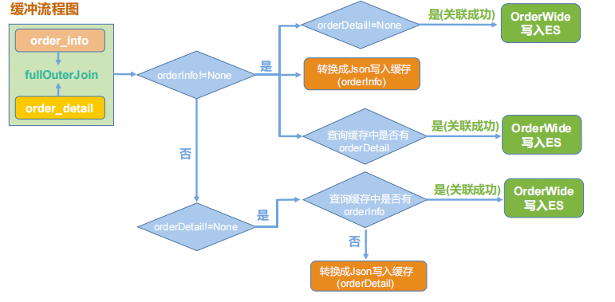</center>

```scala
//5.3 双流Join
// 内连接 join  结果集取交集
// 外连接
//   左外连  leftOuterJoin   左表所有+右表的匹配  , 分析清楚主(驱动)表 从(匹配表) 表
//   右外连  rightOuterJoin  左表的匹配 + 右表的所有,分析清楚主(驱动)表 从(匹配表) 表
//   全外连  fullOuterJoin   两张表的所有

// 从数据库层面： order_info 表中的数据 和 order_detail表中的数据一定能关联成功.
// 从流处理层面:  order_info 和  order_detail是两个流， 流的join只能是同一个批次的数据才能进行join
//               如果两个表的数据进入到不同批次中， 就会join不成功.
// 数据延迟导致的数据没有进入到同一个批次，在实时处理中是正常现象. 我们可以接收因为延迟导致最终的结果延迟.
// 我们不能接收因为延迟导致的数据丢失.
val orderInfoKVDStream: DStream[(Long, OrderInfo)] =
orderInfoDimDStream.map( orderInfo => (orderInfo.id , orderInfo))

val orderDetailKVDStream: DStream[(Long, OrderDetail)] =
orderDetailDStream.map(orderDetail => (orderDetail.order_id , orderDetail))

//val orderJoinDStream: DStream[(Long, (OrderInfo, OrderDetail))] =
//    orderInfoKVDStream.join(orderDetailKVDStream)

// 解决:
//  1. 扩大采集周期 ， 治标不治本
//  2. 使用窗口,治标不治本 , 还要考虑数据去重 、 Spark状态的缺点
//  3. 首先使用fullOuterJoin,保证join成功或者没有成功的数据都出现到结果中.
//     让双方都多两步操作, 到缓存中找对的人， 把自己写到缓存中
val orderJoinDStream: DStream[(Long, (Option[OrderInfo], Option[OrderDetail]))] =
orderInfoKVDStream.fullOuterJoin(orderDetailKVDStream)

val orderWideDStream: DStream[OrderWide] = orderJoinDStream.mapPartitions(
    orderJoinIter => {
        val jedis: Jedis = MyRedisUtils.getJedisFromPool()
        val orderWides: ListBuffer[OrderWide] = ListBuffer[OrderWide]()
        for ((key, (orderInfoOp, orderDetailOp)) <- orderJoinIter) {
            //orderInfo有， orderDetail有
            if (orderInfoOp.isDefined) {
                //取出orderInfo
                val orderInfo: OrderInfo = orderInfoOp.get
                if (orderDetailOp.isDefined) {
                    //取出orderDetail
                    val orderDetail: OrderDetail = orderDetailOp.get
                    //组装成orderWide
                    val orderWide: OrderWide = new OrderWide(orderInfo, orderDetail)
                    //放入到结果集中
                    orderWides.append(orderWide)
                }
                //orderInfo有，orderDetail没有

                //orderInfo写缓存
                // 类型:  string
                // key :   ORDERJOIN:ORDER_INFO:ID
                // value :  json
                // 写入API:  set
                // 读取API:  get
                // 是否过期: 24小时
                val redisOrderInfoKey: String = s"ORDERJOIN:ORDER_INFO:${orderInfo.id}"
                //jedis.set(redisOrderInfoKey , JSON.toJSONString(orderInfo , new SerializeConfig(true)))
                //jedis.expire(redisOrderInfoKey , 24 * 3600)
                jedis.setex(redisOrderInfoKey, 24 * 3600, JSON.toJSONString(orderInfo, new SerializeConfig(true)))

                //orderInfo读缓存
                val redisOrderDetailKey: String = s"ORDERJOIN:ORDER_DETAIL:${orderInfo.id}"
                val orderDetails: util.Set[String] = jedis.smembers(redisOrderDetailKey)
                if (orderDetails != null && orderDetails.size() > 0) {
                    import scala.collection.JavaConverters._
                    for (orderDetailJson <- orderDetails.asScala) {
                        val orderDetail: OrderDetail = JSON.parseObject(orderDetailJson, classOf[OrderDetail])
                        //组装成orderWide
                        val orderWide: OrderWide = new OrderWide(orderInfo, orderDetail)
                        //加入到结果集中
                        orderWides.append(orderWide)
                    }
                }

            } else {
                //orderInfo没有， orderDetail有
                val orderDetail: OrderDetail = orderDetailOp.get
                //读缓存
                val redisOrderInfoKey: String = s"ORDERJOIN:ORDER_INFO:${orderDetail.order_id}"
                val orderInfoJson: String = jedis.get(redisOrderInfoKey)
                if (orderInfoJson != null && orderInfoJson.size > 0) {
                    val orderInfo: OrderInfo = JSON.parseObject(orderInfoJson, classOf[OrderInfo])
                    //组装成orderWide
                    val orderWide: OrderWide = new OrderWide(orderInfo, orderDetail)
                    //加入到结果集中
                    orderWides.append(orderWide)
                } else {
                    //写缓存
                    // 类型:   set
                    // key :   ORDERJOIN:ORDER_DETAIL:ORDER_ID
                    // value :  json, json ....
                    // 写入API: sadd
                    // 读取API: smembers
                    // 是否过期: 24小时
                    val redisOrderDetailKey: String = s"ORDERJOIN:ORDER_DETAIL:${orderDetail.order_id}"
                    jedis.sadd(redisOrderDetailKey, JSON.toJSONString(orderDetail, new SerializeConfig(true)))
                    jedis.expire(redisOrderDetailKey, 24 * 3600)
                }
            }
        }
        jedis.close()
        orderWides.iterator
    }
)
//orderWideDStream.print(1000)
```


#### 写入es

（1）**建索引模板**

```scala
PUT _template/gmall_order_wide_template
{
    "index_patterns": ["gmall_order_wide*"], 
    "settings": { 
        "number_of_shards": 3
    },
    "aliases" : { 
        "{index}-query": {},
        "gmall_order_wide-query":{}
    },
    "mappings" : {
        "properties" : {
            "detail_id" : {
                "type" : "keyword"
            },
            "order_id" : {
                "type" : "keyword" 
            },
            "sku_id" : {
                "type" : "keyword"
            },
            "sku_num" : {
                "type" : "long"
            },
            "sku_name" : {
                "type" : "text",
                "analyzer": "ik_max_word"
            },
            "order_price" : {
                "type" : "float"
            },
            "split_total_amount" : {
                "type" : "float"
            },
            "split_activity_amount" : {
                "type" : "float"
            },
            "split_coupon_amount" : {
                "type" : "float"
            },
            "province_id" : {
                "type" : "keyword"
            },
            "order_status" : {
                "type" : "keyword"
            },
            "user_id" : {
                "type" : "keyword"
            },
            "total_amount" : {
                "type" : "float"
            },
            "activity_reduce_amount" : {
                "type" : "float"
            },
            "coupon_reduce_amount" : {
                "type" : "float"
            },
            "original_total_amount" : {
                "type" : "float"
            },
            "feight_fee" : {
                "type" : "float"
            },
            "feight_fee_reduce" : {
                "type" : "float"
            },
            "expire_time" : {
                "type" : "date" ,
                "format" : "yyyy-MM-dd HH:mm:ss"
            },
            "refundable_time" : {
                "type" : "date" ,
                "format" : "yyyy-MM-dd HH:mm:ss"
            },
            "create_time" : {
                "type" : "date" ,
                "format" : "yyyy-MM-dd HH:mm:ss"
            },
            "operate_time" : {
                "type" : "date" ,
                "format" : "yyyy-MM-dd HH:mm:ss"
            },
            "create_date" : {
                "type" : "keyword"
            },
            "create_hour" : {
                "type" : "keyword"
            }, 
            "province_name" : {
                "type" : "keyword"
            }, 
            "province_area_code" : {
                "type" : "keyword"
            }, 
            "province_3166_2_code" : {
                "type" : "keyword"
            }, 
            "province_iso_code" : {
                "type" : "keyword" 
            }, 
            "user_age" : {
                "type" : "long"
            },
            "user_gender" : {
                "type" : "keyword" 
            } 
        }
    }
}
```

（2）业务代码

```scala
//写入ES
//1. 索引分割， 通过索引模板控制mapping setting aliases
//2. 使用工具类将数据写入ES
orderWideDStream.foreachRDD(
    rdd => {
        rdd.foreachPartition(
            orderWideIter => {
                val orderWides: List[(String, OrderWide)] =
                orderWideIter.map( orderWide => (orderWide.detail_id.toString , orderWide)).toList
                if(orderWides.size > 0 ){
                    val head: (String, OrderWide) = orderWides.head
                    val date: String = head._2.create_date
                    //索引名
                    val indexName : String = s"gmall_order_wide_1018_$date"
                    //写入到ES
                    MyEsUtils.bulkSave(indexName , orderWides)
                }
            }
        )
        //提交offsets
        MyOffsetUtils.saveOffset(orderInfoTopicName , orderInfoGroup , orderInfoOffsetRanges)
        MyOffsetUtils.saveOffset(orderDetailTopicName , orderDetailGroup ,orderDetailOffsetRanges)
    }
)
```


## ES

### 简介

ElasticSearch 是一个基于 Lucene 的搜索服务器。它提供了一个分布式多用户能力的全文搜索引擎，基于 RESTful web 接口。Elasticsearch 是用 Java 开发的，并作为 Apache 许可条款下的开放源码发布，是当前流行的企业级搜索引擎。

### 使用场景

1. 为用户提供按关键字查询的全文搜索功能。 
2. 实现企业海量数据的处理分析的解决方案。大数据领域的重要一份子，如著名的ELK 框架(ElasticSearch,Logstash,Kibana)。 
3. 作为 OLAP 数据库，对数据进行统计分析。

### 与其他数据存储进行比较

|               | redis         | mysql              | es                                                           | hbase                                                        | Hadoop/hive     |
| ------------- | ------------- | ------------------ | ------------------------------------------------------------ | ------------------------------------------------------------ | --------------- |
| 容量/容量扩展 | 低            | 中                 | 较大                                                         | 海量                                                         | 海量            |
| 查询时效性    | 极高          | 较高(需要索引优化) | 较高                                                         | 较高(rowkey方式)；较低(scan方式)                             | 低              |
| 查询灵活性    | 最差，k-v模式 | 非常好，支持sql    | 较好，关联查询较弱，但是可以全文检索，DSL 语言可以处理过滤、匹配、排序、聚合等各种操作 | 较差，主要靠 rowkey,scan 的话性能不行，或者安装 phoenix 插件来实现 sql 及二级索引 | 非常好，支持sql |
| 写入速度      | 极快          | 中等(同步写入)     | 较快(异写入)                                                 | 较快(异步写入)                                               | 慢              |
| 一致性、事务  | 弱            | 强                 | 弱                                                           | 弱                                                           | 弱              |


### 特点

#### 天然的分布式数据库

ES 把数据分成多个 shard（分片），下图中的 P0-P2，多个 shard 可以组成一份完整的数据，这些 shard 可以分布在集群中的各个机器节点中。随着数据的不断增加，集群可以增加多个分片，把多个分片放到多个机子上，已达到负载均衡，横向扩展。

<center>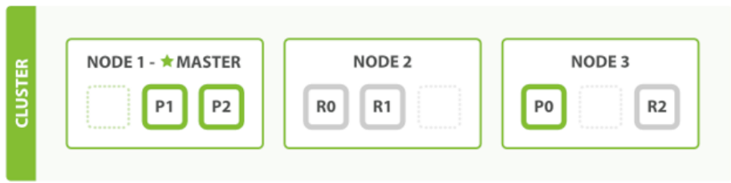</center>


#### 天然索引之倒排索引

**ES 所有数据都是默认进行索引的**，这点和 mysql 正好相反，mysql 是默认不加索引，要加索引必须特别说明，ES 只有不加索引才需要说明。而 ES 使用的是倒排索引和 Mysql 的 B+Tree 索引不同。 

**传统关系性数据库索引**保存数据的方式是 记录→单词：

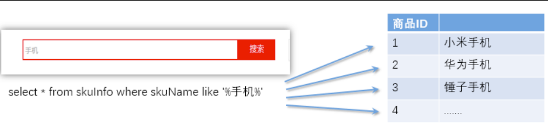

弊端：对于传统的关系性数据库对于关键词的查询，只能逐字逐行的匹配，性能非常差。匹配方式不合理，比如搜索“小密手机” ，如果用 like 进行匹配， 根本匹配不到。但是考虑使用者的用户体验的话，除了完全匹配的记录，还应该显示一部分近似匹配的记录，至少应该匹配到“手机”。

**倒排索引：**全文搜索引擎目前主流的索引技术就是倒排索引的方式。倒排索引的保存数据的方式是 单词→记录：

<center>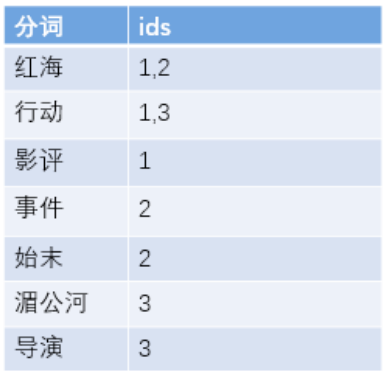</center>

基于分词技术构建倒排索引：

首先每个记录保存数据时，都不会直接存入数据库。系统先会对数据进行分词，然后以倒排索引结构保存。然后等到用户搜索的时候，会把搜索的关键词也进行分词，会把“红海行动”分词分成：红海和行动两个词。这样的话，先用红海进行匹配，得到 id 为 1 和 2 的记录编号，再用行动匹配可以迅速定位 id 为 1,3 的记录。

那么全文索引通常，还会根据匹配程度进行打分，显然 1 号记录能匹配的次数更多。所以显示的时候以评分进行排序的话，1 号记录会排到最前面。而 2、3 号记录也可以匹配到。


#### 索引结构

（1）**B+ tree**

<center></center>

（2）**lucene 倒排索引结构**

<center>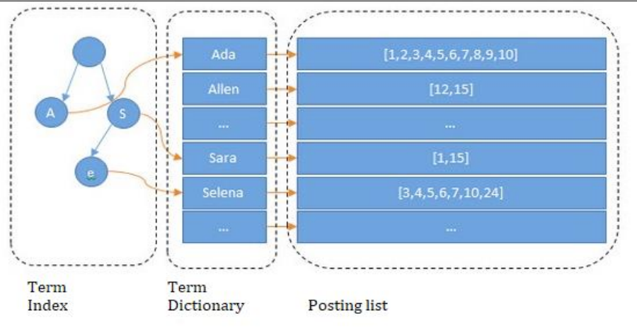</center>

可以看到 lucene 为倒排索引(Term Dictionary)部分又增加一层 Term Index 结构，用于快速定位，而这 Term Index 是缓存在内存中的，但 mysql 的 B+tree 不在内存中，所以整体来看 ES 速度更快，但同时也更消耗资源（内存、磁盘）。 

Term index → Term dictionary → posting list 


#### 天然索引之正排索引( Doc Value列式存储)

倒排索引在搜索包含指定词条的文档时非常高效，但是在相反的操作时表现很差：查询一个文档中包含哪些词条。具体来说，倒排索引在搜索时最为高效，但在排序、聚合等与指定字段相关的操作时效率低下，需要用 doc_values。 

在 Elasticsearch 中，Doc Values 就是一种列式存储结构，默认情况下每个字段的 Doc Values 都是激活的。

索引中某个字段的存储结构如下：

<center>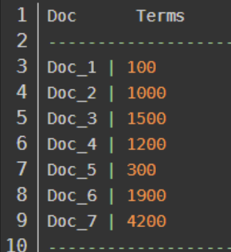</center>

列式存储结构非常适合排序、聚合以及字段相关的脚本操作。而且这种存储方式便于压缩，尤其是数字类型。压缩后能够大大减少磁盘空间，提升访问速度。


### lucene与Elasticsearch的关系

咱们之前讲的处理分词，构建倒排索引，等等，都是这个叫 lucene 的做的。那么能不能说这个 lucene 就是搜索引擎呢？

还不能。lucene 只是一个提供全文搜索功能类库的核心工具包，而真正使用它还需要一个完善的服务框架搭建起来的应用。

好比 lucene 是类似于发动机，而搜索引擎软件（ES,Solr）就是汽车。

目前市面上流行的搜索引擎软件，主流的就两款，elasticsearch 和 solr,这两款都是基于lucene 的搭建的，可以独立部署启动的搜索引擎服务软件。由于内核相同，所以两者除了服务器安装、部署、管理、集群以外，对于数据的操作，修改、添加、保存、查询等等都十分类似。就好像都是支持 sql 语言的两种数据库软件。只要学会其中一个另一个很容易上手。

从实际企业使用情况来看，elasticSearch 的市场份额逐步在取代 solr，国内百度、京东、新浪都是基于 elasticSearch 实现的搜索功能。国外就更多了 像维基百科、GitHub、Stack Overflow 等等也都是基于 ES 的。


### 安装

#### 修改操作系统参数

因为默认 elasticsearch 是单机访问模式，就是只能自己访问自己。但是我们会设置成允许应用服务器通过网络方式访问，而且生产环境也是这种方式。这时，Elasticsearch 就会因为嫌弃单机版的低端默认配置而报错，甚至无法启动。所以我们在这里就要把服务器的一些限制打开，能支持更多并发。

（1）**问题：** **max file descriptors [4096] for elasticsearch process likely too low, increase to at least**  **[65536] elasticsearch**

修改系统允许 Elasticsearch 打开的最大文件数需要修改成 65536。

```bash
vim /etc/security/limits.conf
* soft nofile 65536
* hard nofile 131072
* soft nproc 2048
* hard nproc 65536
```

（2）**问题：max virtual memory areas vm.max_map_count [65530] likely too low, increase to** **at least [262144]** 

修改一个进程可以拥有的虚拟内存区域的数量。

```bash
vim /etc/sysctl.conf
vm.max_map_count=262144
```

（3）**问题：max number of threads [1024] for user [judy2] likely too low, increase to at least [4096]** **（CentOS7.x 不用改）**

修改允许最大线程数为 4096

```bash
vim /etc/security/limits.d/20-nproc.conf
* soft nproc 4096
```

（4）**重启** **linux** **使配置生效**


#### 安装es

（1）**上传安装包，将** **elasticsearch** **安装包上传到** **opt/software/目录下**

（2）**将** **ES** **解压到/opt/module目录下**

```bash
tar -zxvf elasticsearch-7.8.0.tar.gz -C /opt/module/
```

（3）**在/opt/module目录下对ES重命名**

```bash
 mv elasticsearch-7.8.0 es7
```

（4）**修改** **ES** **配置文件** **elasticsearch.yml**

```bash
 cd config/
 vim elasticsearch.yml
```

```bash
（1）集群名称，同一集群名称必须相同
cluster.name: my-es
（2）单个节点名称，不同节点名称不能一样，例如:node-1,node-2,node-3
node.name: node-1
（3）把 bootstrap 自检程序关掉
bootstrap.memory_lock: false
（4）网络部分
# 允许任意 ip 访问
network.host: 0.0.0.0
# 数据服务端口
http.port: 9200 
# 集群间通信端口
transport.tcp.port: 9301
（5）自发现配置：新节点向集群报到的主机名
#集群的”介绍人”节点
discovery.seed_hosts: ["192.168.6.134:9301"]
#默认候选 master 节点
cluster.initial_master_nodes: ["node-1"]
#集群检测的超时时间和次数
discovery.zen.fd.ping_timeout: 1m
discovery.zen.fd.ping_retries: 5
```

> 上面的配置最好不要少，我把集群的少了但是出错了。最后全加上了。

（5）**教学环境启动优化**

ES 是用在 Java 虚拟机中运行的，虚拟机默认启动占用 1G 内存。但是如果是装在 PC 机学习用，实际用不了 1 个 G。所以可以改小一点内存；但生产环境一般 31G 内存是标配，这个时候需要将这个内存调大。

```bash
vim jvm.options

-Xms512m
-Xmx512m
```


#### 碰到的问题

```java
[2022-09-17T09:43:54,694][ERROR][o.e.b.ElasticsearchUncaughtExceptionHandler] [node-1] uncaught exception in thread [main]
org.elasticsearch.bootstrap.StartupException: java.lang.RuntimeException: can not run elasticsearch as root
	at org.elasticsearch.bootstrap.Elasticsearch.init(Elasticsearch.java:174) ~[elasticsearch-7.8.0.jar:7.8.0]
	at org.elasticsearch.bootstrap.Elasticsearch.execute(Elasticsearch.java:161) ~[elasticsearch-7.8.0.jar:7.8.0]
	at org.elasticsearch.cli.EnvironmentAwareCommand.execute(EnvironmentAwareCommand.java:86) ~[elasticsearch-7.8.0.jar:7.8.0]
	at org.elasticsearch.cli.Command.mainWithoutErrorHandling(Command.java:127) ~[elasticsearch-cli-7.8.0.jar:7.8.0]
	at org.elasticsearch.cli.Command.main(Command.java:90) ~[elasticsearch-cli-7.8.0.jar:7.8.0]
	at org.elasticsearch.bootstrap.Elasticsearch.main(Elasticsearch.java:126) ~[elasticsearch-7.8.0.jar:7.8.0]
	at org.elasticsearch.bootstrap.Elasticsearch.main(Elasticsearch.java:92) ~[elasticsearch-7.8.0.jar:7.8.0]
Caused by: java.lang.RuntimeException: can not run elasticsearch as root
	at org.elasticsearch.bootstrap.Bootstrap.initializeNatives(Bootstrap.java:111) ~[elasticsearch-7.8.0.jar:7.8.0]
	at org.elasticsearch.bootstrap.Bootstrap.setup(Bootstrap.java:178) ~[elasticsearch-7.8.0.jar:7.8.0]
	at org.elasticsearch.bootstrap.Bootstrap.init(Bootstrap.java:393) ~[elasticsearch-7.8.0.jar:7.8.0]
	at org.elasticsearch.bootstrap.Elasticsearch.init(Elasticsearch.java:170) ~[elasticsearch-7.8.0.jar:7.8.0]
	... 6 more
uncaught exception in thread [main]
java.lang.RuntimeException: can not run elasticsearch as root
	at org.elasticsearch.bootstrap.Bootstrap.initializeNatives(Bootstrap.java:111)
	at org.elasticsearch.bootstrap.Bootstrap.setup(Bootstrap.java:178)
	at org.elasticsearch.bootstrap.Bootstrap.init(Bootstrap.java:393)
	at org.elasticsearch.bootstrap.Elasticsearch.init(Elasticsearch.java:170)
	at org.elasticsearch.bootstrap.Elasticsearch.execute(Elasticsearch.java:161)
	at org.elasticsearch.cli.EnvironmentAwareCommand.execute(EnvironmentAwareCommand.java:86)
	at org.elasticsearch.cli.Command.mainWithoutErrorHandling(Command.java:127)
	at org.elasticsearch.cli.Command.main(Command.java:90)
	at org.elasticsearch.bootstrap.Elasticsearch.main(Elasticsearch.java:126)
	at org.elasticsearch.bootstrap.Elasticsearch.main(Elasticsearch.java:92)
For complete error details, refer to the log at /root/es/elasticsearch-7.8.0/logs/my-es.log
```

这里是不能使用root用户：

```bash
adduser es
passwd es
chown -R es:es elasticsearch-7.8.0
chmod 777 elasticsearch-7.8.0
```

切换到es用户运行，又是报错：

```bash
错误: 找不到或无法加载主类 org.elasticsearch.tools.java_version_checker.JavaVersionChecker
```

此时可能是因为将该文件夹放到了/root文件夹下，移动到/opt/moudle下就可以了。

```bash
mv elasticsearch-7.8.0 /opt/moudle
```


#### 启动测试

1. **在** **hadoop102** **上执行启动命令**

   ```bash
   bin/elasticsearch
   ```

2. **查看进程**

   ```bash
   jps
   ```

3. **命令行进行测试**

   ```bash
   curl http://127.0.0.1:9200
   ```

   ```json
   {
     "name" : "node-1",
     "cluster_name" : "my-es",
     "cluster_uuid" : "JjV4RSntTKKRQnEwCu_45g",
     "version" : {
       "number" : "7.8.0",
       "build_flavor" : "default",
       "build_type" : "tar",
       "build_hash" : "757314695644ea9a1dc2fecd26d1a43856725e65",
       "build_date" : "2020-06-14T19:35:50.234439Z",
       "build_snapshot" : false,
       "lucene_version" : "8.5.1",
       "minimum_wire_compatibility_version" : "6.8.0",
       "minimum_index_compatibility_version" : "6.0.0-beta1"
     },
     "tagline" : "You Know, for Search"
   }
   ```

4. **浏览器进行测试**

   在浏览器地址栏中输入: http://192.168.6.134:9200 进行访问

   ```bash
   // 20220917224759
   // http://192.168.6.134:9200/
   
   {
     "name": "node-1",
     "cluster_name": "my-es",
     "cluster_uuid": "JjV4RSntTKKRQnEwCu_45g",
     "version": {
       "number": "7.8.0",
       "build_flavor": "default",
       "build_type": "tar",
       "build_hash": "757314695644ea9a1dc2fecd26d1a43856725e65",
       "build_date": "2020-06-14T19:35:50.234439Z",
       "build_snapshot": false,
       "lucene_version": "8.5.1",
       "minimum_wire_compatibility_version": "6.8.0",
       "minimum_index_compatibility_version": "6.0.0-beta1"
     },
     "tagline": "You Know, for Search"
   }
   ```

   

   
   
   

### Kibana

#### 简介

Elasticsearch 提供了一套全面和强大的 REST API，我们可以通过这套 API 与 ES 集群进行交互。

例如：我们可以通过 API: GET /\_cat/nodes?v获取ES集群节点情况，要想访问这个API，我们需要使用 curl 命令工具来访问 Elasticsearch 服务：curl http://hdp1:9200/_cat/nodes?v ,当然也可以使用任何其他 HTTP/REST 调试工具，例如浏览器、POSTMAN 等。

Kibana 是为 Elasticsearch 设计的开源分析和可视化平台。你可以使用 Kibana 来搜索，查看存储在 Elasticsearch 索引中的数据并与之交互。你可以很容易实现高级的数据分析和可视化，以图表的形式展现出来。

#### 安装

kibana版本下载：https://www.elastic.co/cn/downloads/kibana（mac的虚拟机请选择Linux aarch64）

```bash
1. 上传安装包将 Kibana 安装包上传到服务器，并解压
tar -zxvf kibana-7.8.0-linux-x86_64.tar.gz -C /opt/module/

2. 重命名
mv kibana-7.8.0-linux-x86_64/ kibana7

3. 修改配置
cd config/
vim kibana.yml

4. 授权远程访问
server.host: "0.0.0.0"

5. 指定 ElasticSearch 地址（可以指定多个，多个地之间用逗号分隔）
elasticsearch.hosts: ["http://127.0.0.1:9200"]
```

#### 启动测试

1. **启动** **Kinana**

   ```bash
    bin/kibana
   ```

   root用户没法启动。

2. **查看进程**

   ```bash
   netstat -nltp | grep 5601
   ```

3. **浏览器访问**

   浏览器访问 http://192.168.6.134:5601/


> 出了一些问题，懒得找了，直接docker安装。


### 集群脚本

```shell
#!/bin/bash 
es_home=/opt/module/es7
kibana_home=/opt/module/kibana7
if [ $# -lt 1 ]
then
	echo "USAGE:es.sh {start|stop}"
	exit
fi

case $1 in
"start") 
     #启动 ES
     for i in hadoop102 hadoop103 hadoop104
     do
     	ssh $i "source /etc/profile;nohup ${es_home}/bin/elasticsearch >/dev/null 2>&1 &"
 	done
     #启动 Kibana
     nohup ${kibana_home}/bin/kibana > ${kibana_home}/logs/kibana.log 2>&1 & 
;;
"stop") 
     #停止 Kibana
 	sudo netstat -nltp | grep 5601 |awk '{print $7}' | awk -F / '{print $1}'| xargs kill
 	#停止 ES
 	for i in hadoop102 hadoop103 hadoop104
	do
 		ssh $i "ps -ef|grep $es_home |grep -v grep|awk '{print \$2}'|xargs kill" >/dev/null 2>&1
 	done
;;
*)
	echo "USAGE:es.sh {start|stop}"
	exit
;;
esac
```


### ES介绍

看这篇博客吧：:point_right: [https://blog.csdn.net/qq_44766883/article/details/126973974](https://blog.csdn.net/qq_44766883/article/details/126973974)


## SpringBoot可视化

这部分太简单了，这里我就看了下mapper的逻辑。具体的kibana使用和完整说明可以看pdf文件。

### 日活

DSL:

```json
查询总数:
GET gmall_dau_info_2022-01-14/_search
{
    "_source": ""
    , "size": 0
}
查询分时:
GET gmall_dau_info_2022-01-14/_search
{
    "size": 0
    ,
    "aggs": {
        "groupby_hr": {
            "terms": {
                "field": "hr",
                "size": 24
            }
        }
    } 
} 
```

代码：

```scala
/**
* 日活分析业务处理
*/
@Override
public Map<String, Object> searchDau(String td) {
    Map<String,Object> dauResults  = new HashMap<>();
    //日活总数
    Long dauTotal = searchDauTotal(td);
    dauResults.put("dauTotal",dauTotal) ;

    //今日分时明细
    Map<String, Long> dauTd = searchDauHr(td);
    dauResults.put("dauTd", dauTd);

    //昨日分时明细
    //计算昨日
    LocalDate tdLd = LocalDate.parse(td);
    LocalDate ydLd = tdLd.minusDays(1);
    Map<String, Long> dauYd = searchDauHr(ydLd.toString());
    dauResults.put("dauYd", dauYd);

    return dauResults;
}

public  Map<String,Long> searchDauHr(String td ){
    HashMap<String, Long> dauHr = new HashMap<>();

    String indexName  = dauIndexNamePrefix + td ;
    SearchRequest searchRequest = new SearchRequest(indexName);
    SearchSourceBuilder searchSourceBuilder = new SearchSourceBuilder();
    //不要明细
    searchSourceBuilder.size(0);
    //聚合
    TermsAggregationBuilder termsAggregationBuilder =
    AggregationBuilders.terms("groupbyhr").field("hr").size(24);
    searchSourceBuilder.aggregation(termsAggregationBuilder);
    searchRequest.source(searchSourceBuilder);
    try {
        SearchResponse searchResponse = esClient.search(searchRequest, RequestOptions.DEFAULT);
        Aggregations aggregations = searchResponse.getAggregations();
        ParsedTerms parsedTerms = aggregations.get("groupbyhr");
        List<? extends Terms.Bucket> buckets = parsedTerms.getBuckets();
        for (Terms.Bucket bucket : buckets) {
            String hr = bucket.getKeyAsString();
            long hrTotal = bucket.getDocCount();

            dauHr.put(hr, hrTotal);
        }

        return dauHr ;

    } catch (ElasticsearchStatusException ese){
        if(ese.status() == RestStatus.NOT_FOUND){
            log.warn( indexName +" 不存在......");
        }
    } catch (IOException e) {
        e.printStackTrace();
        throw new RuntimeException("查询ES失败....");
    }

    return dauHr ;
}


public Long searchDauTotal(String td ){
    String indexName = dauIndexNamePrefix + td ;
    SearchRequest searchRequest = new SearchRequest(indexName);
    SearchSourceBuilder searchSourceBuilder = new SearchSourceBuilder();
    //不要明细
    searchSourceBuilder.size(0);
    searchRequest.source(searchSourceBuilder);
    try {
        SearchResponse searchResponse = esClient.search(searchRequest, RequestOptions.DEFAULT);
        long dauTotals = searchResponse.getHits().getTotalHits().value;
        return dauTotals ;
    }catch (ElasticsearchStatusException ese){
        if(ese.status() == RestStatus.NOT_FOUND){
            log.warn( indexName +" 不存在......");
        }
    } catch (IOException e) {
        e.printStackTrace();
        throw new RuntimeException("查询ES失败....");
    }
    return 0L;
}
```


### 交易分析业务处理

以年龄为例，DSL：

```json
GET gmall_order_wide_2022-01-14/_search
{
    "query": {
        "match": {
            "sku_name":{
                "query": "小米手机"
                ,
                "operator": "and"
            }
        }
    }
    ,
    "aggs": {
        "groupby_gender": {
            "terms": {
                "field": "user_gender",
                "size": 2
            }
            ,
            "aggs": {
                "sum_amount": {
                    "sum": {
                        "field": "split_total_amount"
                    }
                }
            }
        }
    }
    ,
    "size": 0
}
```

代码:

```scala
/**
* 交易分析业务处理
*/
@Override
public  List<NameValue> searchStatsByItem(String itemName, String date, String field) {
    ArrayList<NameValue> results = new ArrayList<>();
    String indexName = orderIndexNamePrefix + date ;
    SearchRequest searchRequest = new SearchRequest(indexName);
    SearchSourceBuilder searchSourceBuilder = new SearchSourceBuilder();
    //不需要明细
    searchSourceBuilder.size(0);
    //query
    MatchQueryBuilder matchQueryBuilder =
    QueryBuilders.matchQuery("sku_name", itemName).operator(Operator.AND);
    searchSourceBuilder.query(matchQueryBuilder);
    //group
    TermsAggregationBuilder termsAggregationBuilder =
    AggregationBuilders.terms("groupby" + field).field(field).size(100);
    //sum
    SumAggregationBuilder sumAggregationBuilder =
    AggregationBuilders.sum("totalamount").field("split_total_amount");
    termsAggregationBuilder.subAggregation(sumAggregationBuilder);
    searchSourceBuilder.aggregation(termsAggregationBuilder);

    searchRequest.source(searchSourceBuilder);
    try {
        SearchResponse searchResponse = esClient.search(searchRequest, RequestOptions.DEFAULT);
        Aggregations aggregations = searchResponse.getAggregations();
        ParsedTerms parsedTerms = aggregations.get("groupby" + field);
        List<? extends Terms.Bucket> buckets = parsedTerms.getBuckets();
        for (Terms.Bucket bucket : buckets) {
            String key = bucket.getKeyAsString();
            Aggregations bucketAggregations = bucket.getAggregations();
            ParsedSum parsedSum = bucketAggregations.get("totalamount");
            double totalamount = parsedSum.getValue();
            results.add(new NameValue(key ,totalamount));
        }
        return results ;

    } catch (ElasticsearchStatusException ese){
        if(ese.status() == RestStatus.NOT_FOUND){
            log.warn( indexName +" 不存在......");
        }
    } catch (IOException e) {
        e.printStackTrace();
        throw new RuntimeException("查询ES失败....");
    }
    return results;
}
```


### 交易分析明细

DSL：

```json
GET gmall_order_wide_2022-01-14/_search
{
    "query": {
        "match": {
            "sku_name": {
                "query": "小米手机"
                ,
                "operator": "and"
            }
        }
    }
    ,
    "size": 20,
    "from": 0,
    "_source": 
    ["create_time","order_price","province_name","sku_name","sku_num"
     ,"total_amount","user_age","user_gender"],
    "highlight": {
        "fields": {"sku_name": {}}
    } }
```

代码：

```scala
/**
     * 交易分析 明细
     */
@Override
public Map<String, Object> searchDetailByItem(String date, String itemName, Integer from, Integer pageSize) {
    HashMap<String, Object> results = new HashMap<>();

    String indexName  = orderIndexNamePrefix + date ;
    SearchRequest searchRequest = new SearchRequest(indexName);
    SearchSourceBuilder searchSourceBuilder = new SearchSourceBuilder();
    //明细字段
    searchSourceBuilder.fetchSource(new String[]{"create_time", "order_price", "province_name" , "sku_name", "sku_num", "total_amount","user_age","user_gender"}, null );
    //query
    MatchQueryBuilder matchQueryBuilder = QueryBuilders.matchQuery("sku_name", itemName).operator(Operator.AND);
    searchSourceBuilder.query(matchQueryBuilder);

    //form
    searchSourceBuilder.from(from);
    //size
    searchSourceBuilder.size(pageSize);

    //高亮
    HighlightBuilder highlightBuilder = new HighlightBuilder();
    highlightBuilder.field("sku_name");
    searchSourceBuilder.highlighter(highlightBuilder);

    searchRequest.source(searchSourceBuilder);
    try {
        SearchResponse searchResponse = esClient.search(searchRequest, RequestOptions.DEFAULT);
        long total = searchResponse.getHits().getTotalHits().value;
        SearchHit[] searchHits = searchResponse.getHits().getHits();
        ArrayList<Map<String, Object>> sourceMaps = new ArrayList<>();

        for (SearchHit searchHit : searchHits) {
            //提取source
            Map<String, Object> sourceMap = searchHit.getSourceAsMap();
            //提取高亮
            Map<String, HighlightField> highlightFields = searchHit.getHighlightFields();
            HighlightField highlightField = highlightFields.get("sku_name");
            Text[] fragments = highlightField.getFragments();
            String highLightSkuName = fragments[0].toString();
            //使用高亮结果覆盖原结果
            sourceMap.put("sku_name",highLightSkuName ) ;

            sourceMaps.add(sourceMap);
        }
        //最终结果
        results.put("total",total );
        results.put("detail", sourceMaps);

        return results ;
    } catch (ElasticsearchStatusException ese){
        if(ese.status() == RestStatus.NOT_FOUND){
            log.warn( indexName +" 不存在......");
        }
    } catch (IOException e) {
        e.printStackTrace();
        throw new RuntimeException("查询ES失败....");
    }
    return results;
}
```


